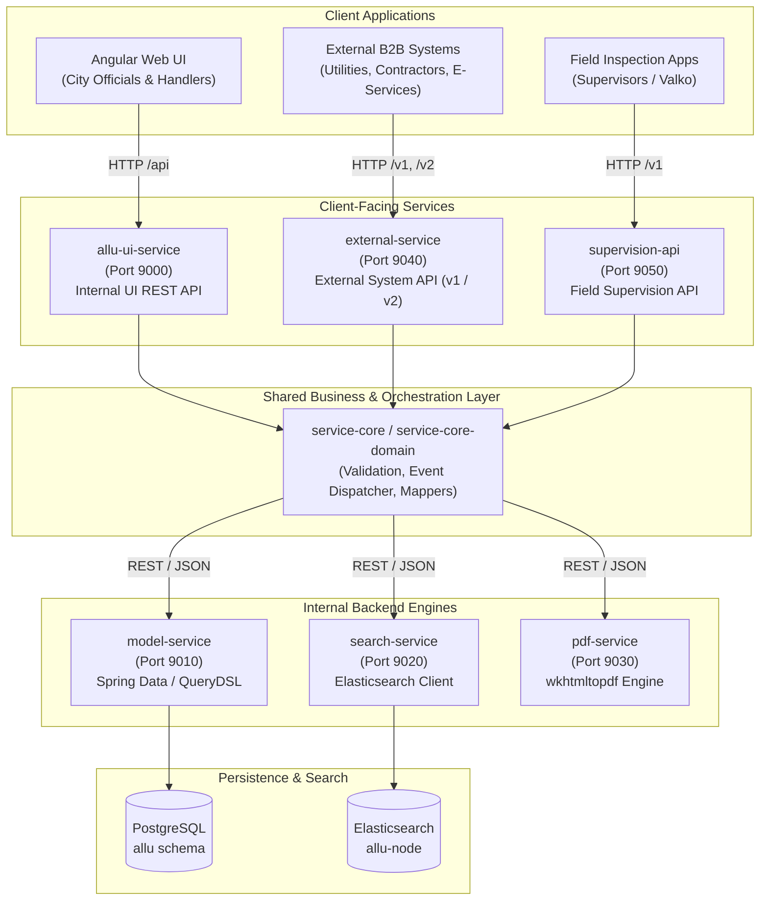
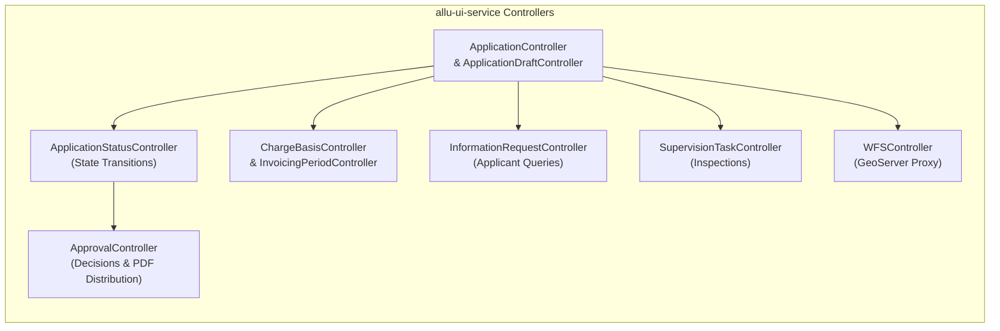
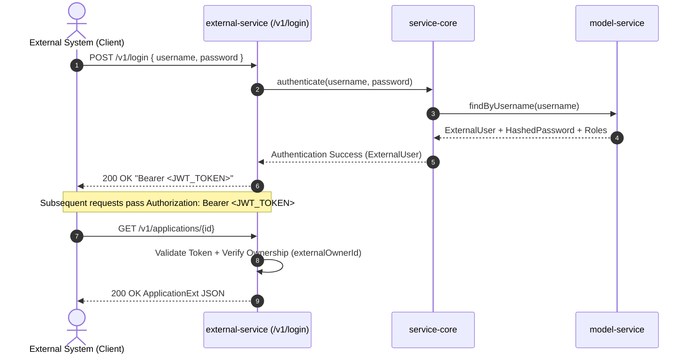
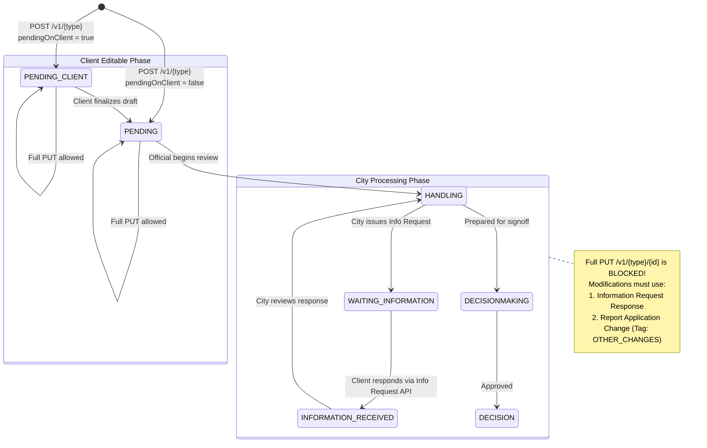
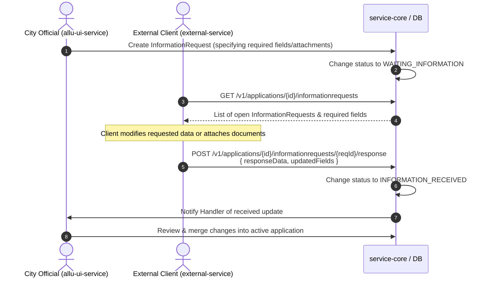
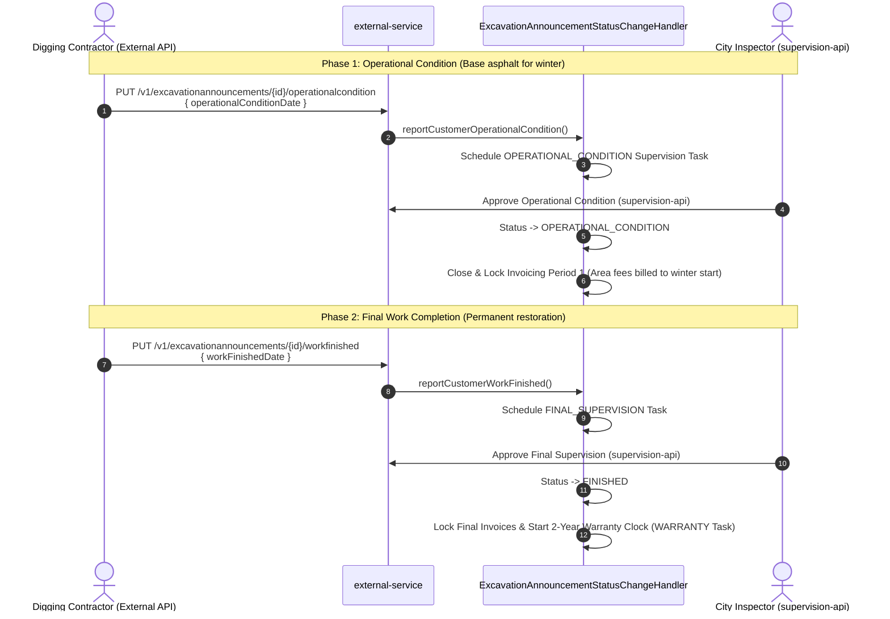
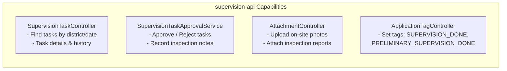

# API Architecture & Integration Guide

This document provides a comprehensive guide to the REST APIs and integration services within the Allu platform, focusing on the **Internal UI REST API** (`allu-ui-service`) and the **External System API** (`external-service`), as well as the **Field Supervision API** (`supervision-api`).

---

## 1. System Topology & API Overview

Allu adopts a distributed service-oriented architecture. Public and client-facing traffic is divided across three dedicated Spring Boot services, which orchestrate business logic via a shared library (`service-core`) and delegate persistence, search, and document rendering to internal backends.

### Microservice Port Map

| Service | Port | Audience | Documentation / Spec |
| --- | --- | --- | --- |
| `allu-ui-service` | `9000` | Angular frontend client | Internal code contracts (`*Json`) |
| `external-service` | `9040` | Third-party systems, utilities, e-services | OpenAPI 3 / Swagger (`/swagger-ui.html`) |
| `supervision-api` | `9050` | Field inspectors, mobile clients | OpenAPI 3 / Swagger (`/swagger-ui.html`) |
| `model-service` | `9010` | Internal only (CRUD engine) | Internal service REST |
| `search-service` | `9020` | Internal only (Elasticsearch queries) | Internal service REST |
| `pdf-service` | `9030` | Internal only (PDF generator) | Internal service REST |

Ports appear here for orientation alongside each API's audience and spec.
[environments.md](environments.md) §4 is canonical for the deployment port map —
change it there first.

---

## 2. Internal UI REST API (`allu-ui-service`)

The UI service powers the main back-office application used by City of Helsinki handlers, decision-makers, and administrators.

### 2.1 Authentication & Roles

- **Production:** Microsoft Azure Active Directory / ADFS OAuth2 authorization code flow.
- **Local Dev / Test:** `POST /auth/login` returning an HMAC-signed JWT Bearer token valid for 12 hours.
- **Role Permissions (`RoleType`):**
  - `ROLE_VIEW`: Search and read-only access to applications, history, and attachments.
  - `ROLE_CREATE_APPLICATION`: Internal application creation.
  - `ROLE_PROCESS_APPLICATION`: Application intake, handling, geometry modification, customer assignment.
  - `ROLE_DECISION`: Issuing binding permit decisions (proposals, approval, rejection).
  - `ROLE_SUPERVISE`: Scheduling and marking supervision tasks.
  - `ROLE_INVOICING`: Reviewing and releasing invoice rows to SAP.
  - `ROLE_ADMIN`: Global system configuration, pricing tariffs, and user role management.

### 2.2 Core Controller Responsibilities

- **`ApplicationController`**: Complete lifecycle CRUD, search filters (`POST /applications/search`), history log, and ownership changes.
- **`ApprovalController`**: Compiles decision proposals, generates preview PDFs, and sends official decisions via email to distribution lists (`POST /applications/{id}/decision/send`).
- **`ChargeBasisController` & `InvoicingPeriodController`**: Manages fee rows, manual overrides, discounts, and multi-period billing splits.
- **`WFSController`**: Proxies requests to Helsinki's open and restricted GeoServer layers (`kartta.hel.fi`), providing address geocoding, district lookups, and street payment classes.

---

## 3. External System API (`external-service`)

`external-service` is the public B2B gateway allowing third parties—such as infrastructure utility companies (Helen, Elisa, Telia, DNA, HSY), engineering firms, and the city's citizen portal—to programmatically submit and track applications.

### 3.1 Authentication & Identity Flow

External systems authenticate using dedicated API credentials to obtain a scoped JWT Bearer token:

### 3.2 Roles & Multi-Tenant Isolation

- **`ROLE_SERVICE`**: Automated machine-to-machine integrations.
- **`ROLE_TRUSTED_PARTNER`**: Certified utility operators and major contractors with extended capabilities.
- **`ROLE_INTERNAL`**: External users integrated within the municipal network.
- **Tenant Isolation:**
  Every application created via the External API stores an `externalOwnerId`. All operations (`GET`, `PUT`, uploads) execute `validateOwnedByExternalUser(applicationId)`. If an external user attempts to access an application owned by another organization, the request is rejected with `403 Forbidden` (`application.ext.notowner`).

---

## 4. External Application Lifecycle & Modification Rules

To prevent data corruption while city officials review permits, Allu strictly enforces a state-dependent mutation model.

### 4.1 Creation (`POST /v1/{type}`)

- **Payload:** Type-specific DTO (`ExcavationAnnouncementExt`, `CableReportExt`, `ShortTermRentalExt`, etc.).
- **Drafting (`pendingOnClient`):**
  - When `pendingOnClient: true`, status is set to `PENDING_CLIENT`. City staff will not process it, allowing the client system to freely update the payload.
  - When `pendingOnClient: false`, status moves to `PENDING`, queuing it in city work queues.

### 4.2 Full Updates (`PUT /v1/{type}/{id}`)

- Allowed **only** while the application is in `PENDING_CLIENT` or `PENDING`.
- Once city handling begins (`HANDLING` or later), a full `PUT` request is rejected with `application.ext.notpending`.

### 4.3 Handling Customer Changes via Information Requests

When city handlers require modifications, or when applicants must update an active permit, communication occurs through structured Information Requests:

---

## 5. Post-Decision Life-Cycle & Milestone Reporting

For excavation announcements (`Kaivuilmoitus`), contractors report execution milestones directly through the External API:

### Available External Milestone Endpoints

- `PUT /v1/excavationannouncements/{id}/operationalcondition` — Report winter operational readiness.
- `PUT /v1/excavationannouncements/{id}/workfinished` — Report final surface completion.
- `PUT /v1/excavationannouncements/{id}/validityperiod` — Request an extension to the permit dates.
- `GET /v1/excavationannouncements/{id}/approval/operationalcondition` — Download operational condition PDF certificate.
- `GET /v1/excavationannouncements/{id}/approval/workfinished` — Download final completion certificate.
- `GET /v1/documents/applications/{id}/decision` — Download official decision PDF.

---

## 6. Field Supervision API (`supervision-api`, Port 9050)

`supervision-api` is a specialized interface optimized for city inspectors working on tablets and smartphones on construction sites.

- **Port:** `9050`
- **Swagger / OpenAPI:** Available at `http://localhost:9050/swagger-ui.html`.
- **Target Workflows:**
  - Finding pending site visits by municipal district (`/v1/supervisiontasks/search`).
  - Executing preliminary checks (*Aloitusvalvonta*), operational condition checks (*Toiminnallisen kunnon valvonta*), final checks (*Loppuvalvonta*), and 2-year warranty checks (*Takuuvalvonta*).
  - Approving or rejecting tasks with reason codes and corrective deadlines.
  - Snapping on-site photos and attaching them directly to the application file.

---

## 7. Comparative Feature Matrix

| Feature / Dimension | UI REST API (`allu-ui-service`) | External System API (`external-service`) | Field Supervision API (`supervision-api`) |
| --- | --- | --- | --- |
| **Port** | `9000` | `9040` | `9050` |
| **Primary Consumer** | Angular Web App | B2B Integrators / E-Services | Mobile / Field Inspector Web Apps |
| **Authentication** | Azure AD / OAuth2 + Local JWT | Username/Password Exchange to JWT | Azure AD / OAuth2 + Local JWT |
| **OpenAPI / Swagger** | Not exposed | Fully documented (`/swagger-ui.html`) | Fully documented (`/swagger-ui.html`) |
| **Access Boundary** | Global across all city applications | Restricted to caller's own applications | Scoped to assigned tasks / districts |
| **Full Entity Updates** | Supported across entire lifecycle | Only while in `PENDING` / `PENDING_CLIENT` | Not supported (Inspection notes only) |
| **Document Generation** | Generates, modifies, and emails PDFs | Read-only download of finalized PDFs | Views decisions and attaches photos |
| **Invoicing Operations** | Releasing, locking, updating SAP rows | No invoicing access | Triggers invoice locking via approvals |

---

## 8. Code Reference Map

| Component | Repository Path |
| --- | --- |
| **UI REST Controllers** | `backend/allu-ui-service/src/main/java/fi/hel/allu/ui/controller/` |
| **UI Security Config** | `backend/allu-ui-service/src/main/java/fi/hel/allu/ui/config/SecurityConfig.java` |
| **External REST Controllers** | `backend/external-service/src/main/java/fi/hel/allu/external/controller/api/` |
| **External Security & Token** | `backend/external-service/src/main/java/fi/hel/allu/external/config/SecurityConfig.java` |
| **External Swagger Config** | `backend/external-service/src/main/java/fi/hel/allu/external/config/SwaggerConfig.java` |
| **External DTO Models** | `backend/external-domain/src/main/java/fi/hel/allu/external/domain/` |
| **Supervision Controllers** | `backend/supervision-api/src/main/java/fi/hel/allu/supervision/api/controller/` |
| **Supervision Swagger Config** | `backend/supervision-api/src/main/java/fi/hel/allu/supervision/api/config/SwaggerConfig.java` |
| **Shared Orchestration** | `backend/service-core/src/main/java/fi/hel/allu/servicecore/service/` |
