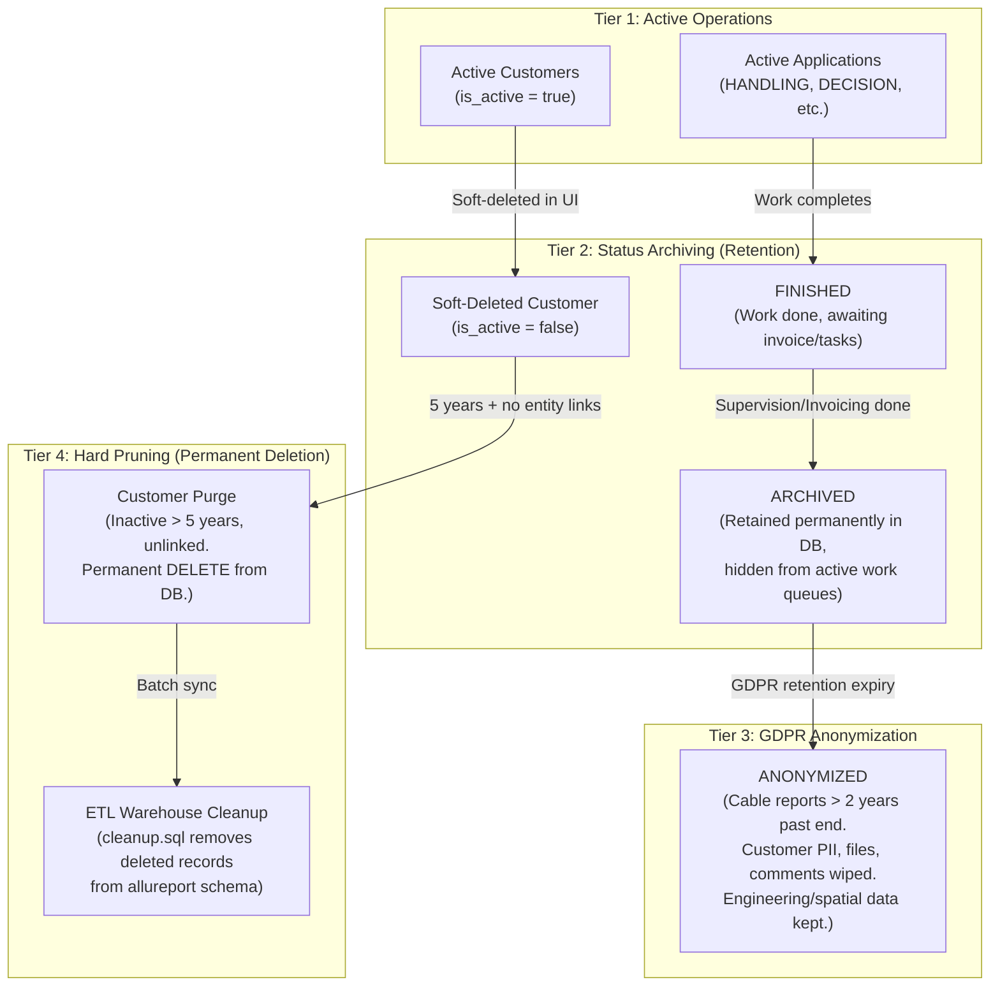
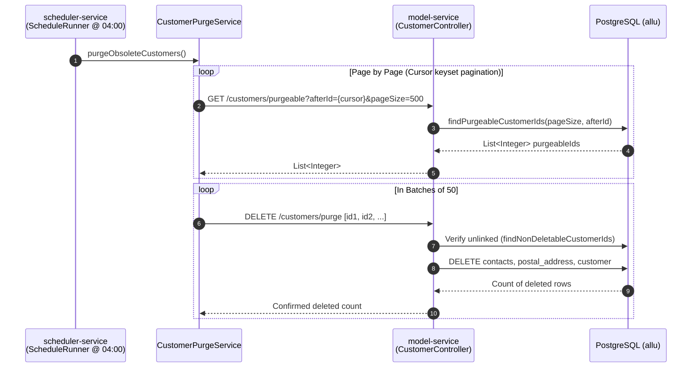
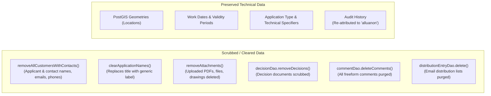

# Data Retention, Archiving & Pruning Architecture

This document details how data retention, status archiving, GDPR anonymization, and permanent database pruning are implemented across the Allu platform.

---

## 1. Lifecycle & Deletion Spectrum Overview

Allu implements a four-tiered data lifecycle model to balance legal municipal record retention against GDPR privacy requirements and database performance:



| Mechanism | Target Entity | Action Type | Retention Threshold | Service / Trigger |
| --- | --- | --- | --- | --- |
| **Application Archiving** | All application types | Status change (`ARCHIVED`) | When invoiced & all supervision tasks closed | `ApplicationArchiverService` (Hourly/Daily cron) |
| **GDPR Anonymization** | Cable reports (`CABLE_REPORT`) | Status change (`ANONYMIZED`) + PII purge | 2 years after permit end date | `ApplicationService:anonymizeApplications` (Nightly 03:00 AM) |
| **Customer Hard Purge** | Customers (`allu.customer`) | Hard SQL `DELETE` | 5 years after last log entry + unlinked | `CustomerPurgeService` (Nightly 04:00 AM) |
| **ETL Reporting Cleanup** | Reporting schema (`allureport`) | Hard SQL `DELETE` | Mirror of operative hard deletions | `allu-etl (cleanup.sql)` |

---

## 2. Hard Pruning: Customer Permanent Deletion (`CustomerPurgeService`)

Implemented under ticket **ALLU-207**, this is the only automated hard-deletion service in the Allu core database.

### 2.1 Eligibility Criteria (`CustomerDao.java`)

A customer row in `allu.customer` is considered purgeable **only when ALL of the following criteria are met simultaneously**:

1. **Soft-deleted:** `customer.is_active = false`.
2. **Unlinked:** Not referenced by any application (`allu.application_customer`), project (`allu.project_customer`), or designated as an invoice recipient (`application.invoice_recipient_id`).
3. **5-Year Log Retention Elapsed:** The latest timestamp across all three audit and history tables must be older than 5 years (`retentionCutoff = now - 5 years`):
   - `allu.change_history` (`MAX(change_time)`)
   - `allu.customer_update_log` (`MAX(update_time)`)
   - `allu.person_audit_log` (`MAX(creation_time)` for both customer and its contacts)
4. **SAP Removal Notified:** If the customer has a SAP customer number (`sap_customer_number IS NOT NULL`), the notification email to city financial administrators must already have been sent (`notification_sent_at IS NOT NULL`).

### 2.2 Purge Execution Flow



- **Circuit Breaker:** If the failure rate of purge batches exceeds 20% (`FAILURE_RATE_THRESHOLD_PERCENT = 20`), the job immediately aborts to avoid cascading errors.
- **Index Optimization (`V200__add_purge_performance_indexes.sql`):** Composite covering indexes were added to `change_history`, `customer_update_log`, and `person_audit_log` to accelerate the 5-year subquery evaluations.
- **Disabling the Job:** Configured in `deployment/group_vars/*/backend.yml`. Setting `customer_purge_cronstring: "0 0 3 31 2 *"` (February 31st) safely disables the cron.

---

## 3. Status Archiving (`ApplicationArchiverService`)

Unlike customer purging, application archiving does **not** delete records from PostgreSQL. It is a state transition that moves applications out of active operational queues while preserving the permanent municipal record.

### 3.1 Eligibility Checklist (`readyForArchive`)

An application transitions to `StatusType.ARCHIVED` when:

1. **End date passed:** `ZonedDateTime.now().isAfter(effectiveEndTime)`.
2. **Archivable status:**
   - Excavations (`EXCAVATION_ANNOUNCEMENT`) and Area Rentals (`AREA_RENTAL`): Must be in `FINISHED` or `TERMINATED`.
   - Cable Reports, Events, Traffic Arrangements: Must be in `DECISION`, `FINISHED`, or `TERMINATED`.
3. **Invoicing settled:** `application.invoiced == true` or `application.notBillable == true`.
4. **No open supervision tasks:** All inspections (`OPERATIONAL_CONDITION`, `FINAL_SUPERVISION`, `WARRANTY`) are approved or cancelled.
5. **No open security deposits:** `applicationTags` contains neither `DEPOSIT_REQUESTED` nor `DEPOSIT_PAID`.
6. **No survey required:** Survey requirement flag is resolved.
7. **Prerequisite decoupling:** If the application is a cable report, it is not linked to any active excavation announcement.

---

## 4. GDPR Anonymization (`ApplicationService.anonymizeApplications`)

Implemented in tickets **ALLU-188** and **ALLU-190**, anonymization scrubs personal data from historic records that must be retained for engineering purposes.



### 4.1 Automated Trigger

- Scheduled nightly at **03:00 AM** (`anonymization.update.cronstring = 0 0 3 * * *`).
- Queries cable reports older than 2 years past their end date:

  ```sql
  WHERE type = 'CABLE_REPORT'
    AND end_time < (NOW() - INTERVAL '2 YEARS')
    AND status != 'ANONYMIZED';
  ```

### 4.2 Scrubbing Process

1. Status is changed to **`StatusType.ANONYMIZED`**.
2. Handlers and decision makers are replaced with the system anonymization user:
   - User: `alluanon`
   - Real Name: *"Anonymisoitu"*
   - User ID: `userDao.findAnonymizationUser()`
3. All customer relations (`application_customer`) and contact cards are deleted.
4. Uploaded attachments and generated decision PDFs are cleared from disk/database (`bytea` columns nullified).
5. **Cascading Replacement Chains:** `includeReplacedApplications()` traverses the `replacesApplicationId` chain so that all past amendment versions of the permit are anonymized simultaneously.

---

## 5. ETL Warehouse Pruning (`allu-etl / cleanup.sql`)

When entities are hard-deleted in the operative database (`allu`), the changes must propagate to the reporting data warehouse (`allureport` schema).

### 5.1 The `cleanup.sql` Routine

- Runs on a dedicated schedule (`ALLU-234`) with its own database connection and `statement_timeout`.
- Uses PostgreSQL Foreign Data Wrapper (`allu_fdw`) to link the reporting database to the operative database.
- **Temporary Table Materialization:**
  Operative IDs are materialized once into `ON COMMIT DROP` temporary tables (e.g. `tmp_customer`, `tmp_application`) to prevent slow anti-joins over foreign tables.
- **Topological Delete Order:**
  Child entities are deleted before parents to prevent foreign key constraint violations:
  $$\text{taydennyspyynto} \longrightarrow \text{valvontatehtava} \longrightarrow \text{laskurivi} \longrightarrow \text{lasku} \longrightarrow \text{kaivuilmoitus} \longrightarrow \text{hakemus} \longrightarrow \text{asiakas}$$

---

## 6. When these jobs run

Schedules live in [scheduled-jobs.md](scheduled-jobs.md), which is canonical for
every cron in the platform. The jobs described above are
`checkAnonymizableApplications`, `sendRemovedSapCustomerNotifications`,
`purgeObsoleteCustomers`, `updateApplicationStatuses`, and the `allu-etl`
`runCleanup` routine.

Note when reading schedules anywhere: a job's local-development cron and its
deployed cron are usually different, and the deployed value is not always
overridable per environment.
