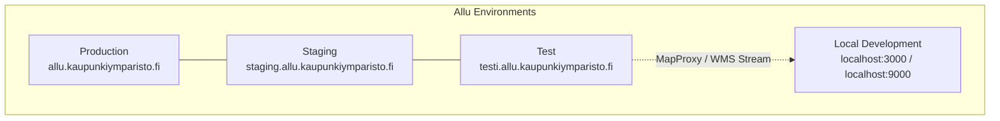
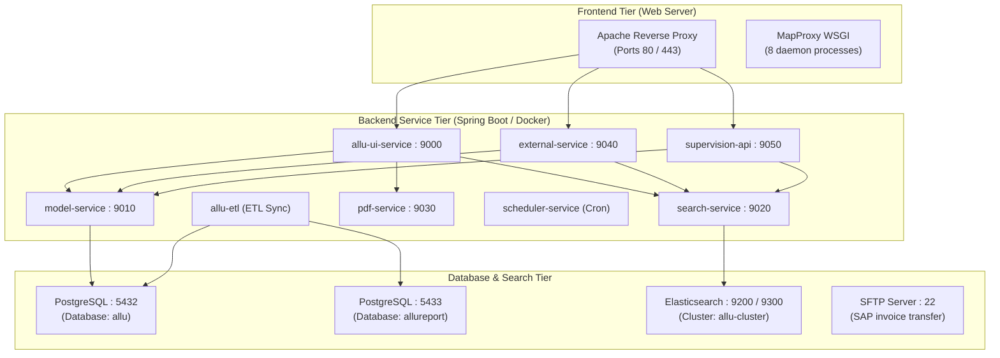
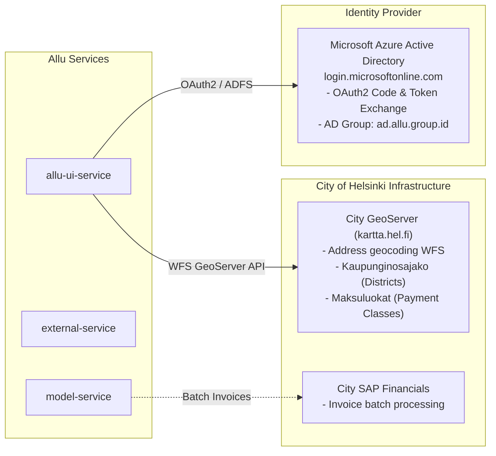

# Environments, Domains & Endpoint Routing

This document details the deployment environments, public domain names, reverse proxy routing rules, and internal service topology for the Allu platform, as defined authoritatively in the Ansible infrastructure-as-code (`deployment/group_vars/` and `deployment/roles/frontend_deploy/templates/virtualhost.conf`).

---

## 1. Environment Landscape

Allu operates across three provisioned server environments plus local containerized development:



| Environment | Base Domain | Primary Purpose | Authoritative IaC |
| --- | --- | --- | --- |
| **Production** | `allu.kaupunkiymparisto.fi` | Live municipal service | `deployment/group_vars/production/` |
| **Staging** | `staging.allu.kaupunkiymparisto.fi` | Pre-release verification & integration testing | `deployment/group_vars/staging/` |
| **Test** | `testi.allu.kaupunkiymparisto.fi` | Automated CI/CD deployments & developer QA | `deployment/group_vars/test/` |
| **Local Dev** | `localhost:3000` (UI), `localhost:9000` (API) | Local workstation sandbox | `frontend/proxy.conf.json` & `docker-compose.yml` |

---

## 2. Public URLs & Endpoint Matrix

All public traffic routes through HTTPS (port 443). Apache reverse proxies incoming requests based on path prefixes:

```mermaid
graph LR
    Client["Client Request<br/>https://allu.kaupunkiymparisto.fi"] --> Apache["Apache 2.4 (VirtualHost 443)<br/>SSL Termination (*.kaupunkiymparisto.fi)"]

    Apache -->|"/"<br/>(SPA fallback)| HTML["Angular 18 SPA<br/>/var/www/html"]
    Apache -->|"/api/"| UI_API["allu-ui-service<br/>(Port 9000)"]
    Apache -->|"/external/"| EXT_API["external-service<br/>(Port 9040)"]
    Apache -->|"/supervision-api/"| SUP_API["supervision-api<br/>(Port 9050)"]
    Apache -->|"/wms", "/tms"| MAP["Python MapProxy<br/>WSGI Daemon"]
```

### Complete URL Directory

#### Production (`https://allu.kaupunkiymparisto.fi`)

- **Official Web Portal (UI):** `https://allu.kaupunkiymparisto.fi/`
- **Internal UI REST API:** `https://allu.kaupunkiymparisto.fi/api/`
- **External System API (v1 / v2):** `https://allu.kaupunkiymparisto.fi/external/`
  - Swagger UI: `https://allu.kaupunkiymparisto.fi/external/swagger-ui.html`
  - OpenAPI Spec: `https://allu.kaupunkiymparisto.fi/external/v3/api-docs`
- **Field Supervision API:** `https://allu.kaupunkiymparisto.fi/supervision-api/`
  - Swagger UI: `https://allu.kaupunkiymparisto.fi/supervision-api/swagger-ui.html`
  - OpenAPI Spec: `https://allu.kaupunkiymparisto.fi/supervision-api/v3/api-docs`
- **OAuth2 Redirect URI:** `https://allu.kaupunkiymparisto.fi/oauth2/`
- **MapProxy Tile & WMS Endpoints:** `https://allu.kaupunkiymparisto.fi/wms`, `.../tms`

#### Staging (`https://staging.allu.kaupunkiymparisto.fi`)

- **Web Portal:** `https://staging.allu.kaupunkiymparisto.fi/`
- **Internal UI API:** `https://staging.allu.kaupunkiymparisto.fi/api/`
- **External System API:** `https://staging.allu.kaupunkiymparisto.fi/external/`
- **Supervision API:** `https://staging.allu.kaupunkiymparisto.fi/supervision-api/`
- **OAuth2 Redirect URI:** `https://staging.allu.kaupunkiymparisto.fi/oauth2/`

#### Test (`https://testi.allu.kaupunkiymparisto.fi`)

- **Web Portal:** `https://testi.allu.kaupunkiymparisto.fi/`
- **Internal UI API:** `https://testi.allu.kaupunkiymparisto.fi/api/`
- **External System API:** `https://testi.allu.kaupunkiymparisto.fi/external/`
- **Supervision API:** `https://testi.allu.kaupunkiymparisto.fi/supervision-api/`

---

## 3. Reverse Proxy Configuration (`virtualhost.conf`)

The edge webserver runs Apache 2.4 configured via `deployment/roles/frontend_deploy/templates/virtualhost.conf`:

```mermaid
flowchart TD
    Req[Incoming Request] --> Scheme{Port 80 or 443?}
    Scheme -->|Port 80| Redir[301 Redirect to HTTPS]
    Scheme -->|Port 443| Match{Request URI Path}

    Match -->|^/api/| P1[ProxyPass -> backend:9000]
    Match -->|^/external/| P2[ProxyPass -> backend:9040<br/>Set X-Forwarded-Prefix /external/]
    Match -->|^/supervision-api/| P3[ProxyPass -> backend:9050<br/>Set X-Forwarded-Prefix /supervision-api/]
    Match -->|^/(wms|tms)/| P4[Python MapProxy WSGI Script]
    Match -->|Static File / Asset| P5[Serve from /var/www/html]
    Match -->|Route Path /login, /application/*| P6[Rewrite to /index.html<br/>Angular SPA Routing]
```

### Key Proxy Rules

1. **Header Normalization:**

   ```apache
   RequestHeader set X-Forwarded-Proto: https
   RequestHeader set X-Forwarded-Prefix /external/ env=WEBHOOK1
   RequestHeader set X-Forwarded-Prefix /supervision-api/ env=WEBHOOK2
   ```

   Ensures Spring Boot builds correct OpenAPI redirect and schema URLs behind the reverse proxy.
2. **SPA Client Routing:**

   ```apache
   RewriteCond %{REQUEST_FILENAME} !-f
   RewriteCond %{REQUEST_URI} !.*\.(css|js|html|png|jpg|jpeg|gif|svg|txt)
   RewriteCond %{REQUEST_URI} !.*{{ proxypass_api_context }}
   RewriteCond %{REQUEST_URI} !.*{{ proxypass_external_context }}
   RewriteCond %{REQUEST_URI} !.*{{ proxypass_supervision_context }}
   RewriteRule (.*) /index.html [L]
   ```

   Directs browser deep-links (e.g. `/application/123/edit`) to Angular's router while preserving API routes.
3. **MapProxy Protection (`mapproxy_block_by_referer`):**
   In production, WMS/TMS requests originating from external referrers are blocked (`RewriteRule ^(/tms|/wms)(.*)$ - [F]`), restricting tile consumption to the Allu web application.

---

## 4. Internal Architecture & Port Mapping

Behind Apache, services communicate over a private internal network:



### Service Port Reference Table

Canonical for the whole documentation set — other documents link here rather
than repeating port numbers. Values verified against each service's
`application.properties`.

| Service Name | Port | Protocol | Purpose |
| --- | --- | --- | --- |
| **Apache HTTP / HTTPS** | `80` / `443` | HTTP/S | Public reverse proxy and static Angular assets |
| **allu-ui-service** | `9000` | HTTP/REST | Internal UI backend orchestrator |
| **model-service** | `9010` | HTTP/REST | Core database entity CRUD (PostgreSQL) |
| **search-service** | `9020` | HTTP/REST | Elasticsearch query interface |
| **pdf-service** | `9030` | HTTP/REST | PDF rendering engine (wkhtmltopdf) |
| **external-service** | `9040` | HTTP/REST | External B2B integration API (OpenAPI) |
| **supervision-api** | `9050` | HTTP/REST | Field supervision mobile API (OpenAPI) |
| **PostgreSQL (Operational)** | `5432` | TCP/JDBC | Primary application database (`allu` schema) |
| **PostgreSQL (Reporting)** | `5433` | TCP/JDBC | Flattended data warehouse (`allureport` schema) |
| **Elasticsearch** | `9200` / `9300` | HTTP / TCP | Application and text search cluster |
| **SFTP Server** | `22` | SFTP | SAP batch invoice export and billing files |

---

## 5. External Integrations & Cloud Services

Allu depends on the following authoritative external City of Helsinki and Microsoft cloud infrastructure:



### 1. City of Helsinki GeoServer (`kartta.hel.fi`)

- **Address Geocoding:** `https://kartta.hel.fi/ws/geoserver/avoindata/wfs?TYPENAME=Helsinki_osoiteluettelo`
- **City District Boundaries:** `https://kartta.hel.fi/ws/geoserver/avoindata/wfs?typeName=avoindata:Kaupunginosajako`
- **Restricted Payment Tariffs:** `https://kartta.hel.fi/ws/geoserver/helsinki/wfs?service=wfs&request=GetFeature`

### 2. Microsoft Azure Active Directory (ADFS)

- **Authorization Endpoint:** `https://login.microsoftonline.com/3feb6bc1-d722-4726-966c-5b58b64df752/oauth2/authorize`
- **Token Exchange:** `https://login.microsoftonline.com/3feb6bc1-d722-4726-966c-5b58b64df752/oauth2/token`
- **JWKS Key Set:** `https://login.microsoftonline.com/3feb6bc1-d722-4726-966c-5b58b64df752/discovery/keys`
- **Allu Staff AD Group:** `63a6a2da-3b1f-4d8b-8663-6ef1e41c3f88`

---

## 6. Local Development Configuration (`proxy.conf.json`)

When developing the frontend locally without running the entire server stack:

```json
{
  "/api": {
    "target": "http://localhost:9000",
    "pathRewrite": {"/api/": ""},
    "secure": false,
    "changeOrigin": false
  },
  "/wms": {
    "target": "https://testi.allu.kaupunkiymparisto.fi",
    "pathRewrite": {"/wms/": "/wms"},
    "secure": false,
    "changeOrigin": true
  },
  "/tms": {
    "target": "https://testi.allu.kaupunkiymparisto.fi",
    "secure": false,
    "changeOrigin": true
  }
}
```

- Local Angular dev server proxies `/api` calls directly to `allu-ui-service` running on port 9000.
- Map requests (`/wms` and `/tms`) are dynamically forwarded to the official **Test** environment at `https://testi.allu.kaupunkiymparisto.fi`, allowing local developers to render city maps without running a local MapProxy instance.
