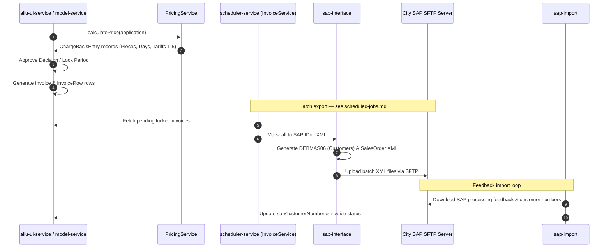
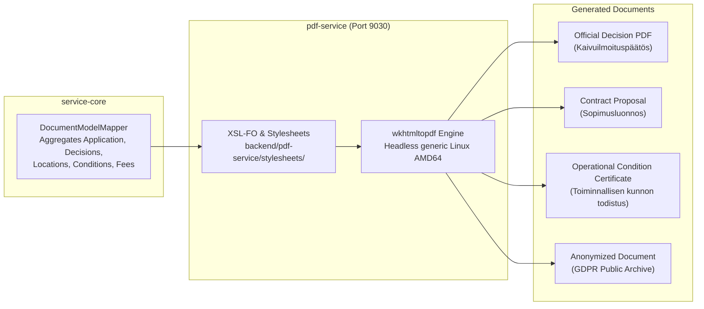
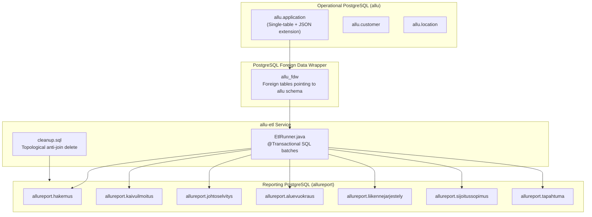
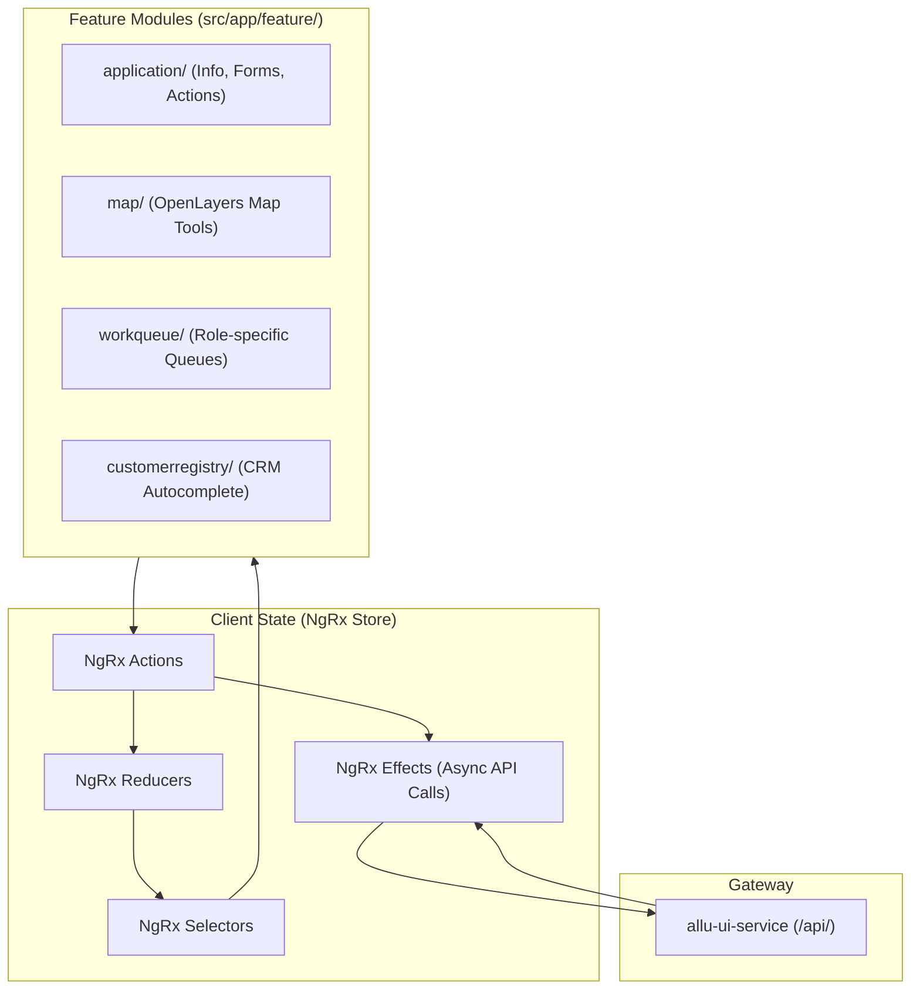

# Subsystem Overview

Short treatments of the subsystems that do not yet have a document of their own:
SAP financials, GIS, PDF generation, the ETL warehouse, the frontend, and the
test tiers.

**Growth rule:** when a section here acquires real depth — more than a page, or
its own gotchas and recipes — promote it to its own file in `architecture/`,
leave a one-line pointer behind, and add it to [`docs/README.md`](../README.md).
Scheduled jobs were promoted this way and now live in
[scheduled-jobs.md](scheduled-jobs.md).

Subsystems that already have their own document: [API
gateways](api-gateways.md), [environments and
routing](environments.md), [data retention and
pruning](data-retention.md), [scheduled jobs](scheduled-jobs.md).

---

## 1. Financials & SAP integration

Allu manages billing internally and pushes finalized invoices to the City of
Helsinki financial system (SAP) via SFTP batch exports.



- **`ChargeBasisEntry`** — atomic billable units (1 handling-fee unit, 45 area
  daily-fee units). Supports manual discounts, price overrides, and zero-fee
  justifications (`notBillableReason`).
- **`InvoicingPeriod`** — partitions multi-year or winter-spanning projects into
  discrete billable cycles.
- **`sap-interface`** (`fi.hel.allu.sap`) — JAXB marshaller producing SAP IDoc
  XML: `DEBMAS06` for customer master data, `SalesOrder` for line items.
- **`sap-import`** — pulls SAP customer registry feedback files back into Allu.
- **`DepositService`** (*Vakuudet*) — collateral demanded from contractors to
  protect public street assets. Tracks `DEPOSIT_REQUESTED`, `DEPOSIT_PAID`,
  returned.

---

## 2. GIS, geospatial architecture & MapProxy

```mermaid
graph TB
    subgraph Clients["Consumers"]
        AngularMap["Angular OpenLayers Map Component"]
        ExternalMap["External System GIS Clients"]
    end

    subgraph ProxyTier["Caching & Boundary Guard"]
        MapProxyWSGI["Python MapProxy (WSGI Daemon)<br/>8 processes / 25 threads<br/>Referrer guard: mapproxy_block_by_referer"]
    end

    subgraph InternalGIS["Allu Database"]
        PostGIS[(PostgreSQL 14 + PostGIS)<br/>EPSG:3879 Projection<br/>ST_Intersects / GeometryCollection]
        ElasticsearchGeo[(Elasticsearch Geo-Shape)]
    end

    subgraph ExternalGIS["City GeoServer (kartta.hel.fi)"]
        Karttasarja["avoindata:Karttasarja (Base Map)"]
        Kantakartta["avoindata:Kantakartta_harmaa (Greyscale)"]
        Asemakaava["avoindata:Ajantasa_asemakaava (Zoning)"]
        Orto["avoindata:Ortoilmakuva (Aerial Ortho)"]
        WFS_Streets["WFS: Helsinki_osoiteluettelo (Addresses)"]
        WFS_Districts["WFS: Kaupunginosajako (Districts)"]
    end

    AngularMap -->|/wms, /tms| MapProxyWSGI
    MapProxyWSGI --> ExternalGIS

    AngularMap -->|WFS Search| WFS_Streets
    AngularMap -->|District Lookup| WFS_Districts

    AngularMap -->|Save Geometries| PostGIS
    PostGIS -.->|Sync Shape Index| ElasticsearchGeo
```

- **Coordinate reference system:** `EPSG:3879` (ETRS-GK25FIN) throughout. All
  coordinates are metres east/north in Helsinki local space.
- **Fixed locations (`allu.fixed_location`):** pre-digitized municipal locations
  with pre-defined areas and payment classes — major squares such as
  Rautatientori, market places, bridge banner positions.
- **MapProxy WSGI:** caches heavy raster layers and restricts tile consumption to
  the Allu web application by referrer.

---

## 3. Document generation (`pdf-service`)

Official municipal decisions are published as archival PDF documents.



Stylesheet inventory:

- `EXCAVATION_ANNOUNCEMENT.xsl` — excavation decisions and conditions.
- `AREA_RENTAL.xsl` — street rental permits and fee schedules.
- `PLACEMENT_CONTRACT.xsl` / `PLACEMENT_CONTRACT-contract.xsl` — infrastructure
  placement agreements.
- `TEMPORARY_TRAFFIC_ARRANGEMENTS.xsl` — traffic modification orders.
- `CABLE_REPORT.xsl` — cable clearance certificates and utility contact lists.

---

## 4. Data warehouse ETL (`allu-etl`)

Allu maintains a separate reporting database (`allureport`) for analytics and
historical reporting, keeping that load off the transactional engine.



- Runs in dedicated transactions using `ON CONFLICT DO UPDATE` semantics.
- Unpacks the polymorphic `extension` column from `allu.application` into
  strongly-typed relational reporting tables.
- City analysts query `allureport` via BI dashboards without locking
  transactional rows.

Schedules are in [scheduled-jobs.md](scheduled-jobs.md); the cleanup half is
covered in [data-retention.md](data-retention.md).

---

## 5. Frontend architecture & client state

Angular 18, modular and reactive.



1. **Module architecture:** organized by functional domain (`application/`,
   `customerregistry/`, `supervision-workqueue/`, `decision/`, `map/`).
2. **Form infrastructure:** complex reactive forms (`ApplicationForm`) with
   cross-field validators (`startBeforeEnd`, `inWinterTime`, `inputWarning`).
3. **MDC component migration:** active transition off legacy Angular Material
   components (`MatLegacy*`), tracked in `PLAN.md` at the repository root.

---

## 6. Test & verification infrastructure

| Harness | Technology | Purpose | Location |
| --- | --- | --- | --- |
| **Backend unit & specs** | JUnit 4/5, Spectrum (BDD) | Unit logic, pricing algorithms, DAO tests | `<module>/src/test/` |
| **Search integration** | Spring Boot Test + embedded ES | Indexing, bool queries, multi-match | `search-service/src/test/` |
| **External API E2E** | Spring Boot Test + REST clients | Third-party contract validation | `external-e2e-test/src/test/` |
| **Internal REST E2E** | Node.js, Jasmine, request-promise | Full multi-service workflow tests | `backend/allu-ui-service-test/` |
| **Mass data generator** | Node.js script | Seeds 10,000 mock applications for load testing | `backend/allu-ui-service-test/massdata/` |
| **Frontend headless** | Karma, Jasmine, ChromeHeadless | Angular component and reducer tests | `frontend/src/test/` |
| **Frontend CI gate** | GitHub Actions | Build, lint (ESLint, 0 errors), tests | `.github/workflows/frontend-ci.yml` |

`frontend-ci.yml` is the **only** workflow in the repository — there is no
automated CI gate for the Java backend.
