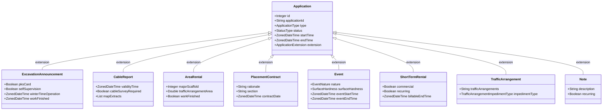

# Application Types

Allu manages eight application types (`ApplicationType`). All of them share the
`allu.application` table and differ by the type-specific model serialized into
its `extension` JSONB column, by their fee structure, and by their workflow.

This file is the shared overview. Types with enough depth to need their own
document get one in this directory — currently only
[excavation announcements](excavation-announcement.md).

## Summary matrix

| ApplicationType | Finnish name | Billable? | Pricing engine | Typical duration | Key specialty |
| --- | --- | --- | --- | --- | --- |
| **`EXCAVATION_ANNOUNCEMENT`** | Kaivuilmoitus | Yes | `ExcavationPricing` | Weeks to years | Two-phase completion (`winterTimeOperation`), 2-year warranty |
| **`CABLE_REPORT`** | Johtoselvitys | **No** (free) | None | 30–60 days | Prerequisite for digging, utility clearances, map sheet orders |
| **`AREA_RENTAL`** | Aluevuokraus | Yes | `AreaRentalPricing` | Days to months | Scaffolds, cranes, skips, containers, multi-period split invoicing |
| **`TEMPORARY_TRAFFIC_ARRANGEMENTS`** | Tilapäinen liikennejärjestely | Yes | Tariff/daily | Days to months | Street/lane closures, detours, bus stop changes, event traffic |
| **`PLACEMENT_CONTRACT`** | Sijoitussopimus | Fixed fee | `PlacementContractPricing` | Permanent | Two-phase contract creation: draft proposal → signed contract |
| **`SHORT_TERM_RENTAL`** | Lyhytaikainen maanvuokraus | Yes | `ShortTermRentalPricing` | Seasonal | Terraces, parklets, food trucks, banners; multi-year recurring |
| **`EVENT`** | Tapahtuma | Yes | `EventPricing` | Days | Surface hardness (asphalt vs grass), event days vs build days |
| **`NOTE`** | Muistiinpano | **No** | None | Ad hoc | Internal bookings: snow dumping, city bikes, election stands |

## Coverage

Only `EXCAVATION_ANNOUNCEMENT` is documented in depth so far, because that is
what the initial investigation needed. The remaining seven are covered by this
matrix alone. When adding one, give it its own file in this directory and link
it from the table above.
