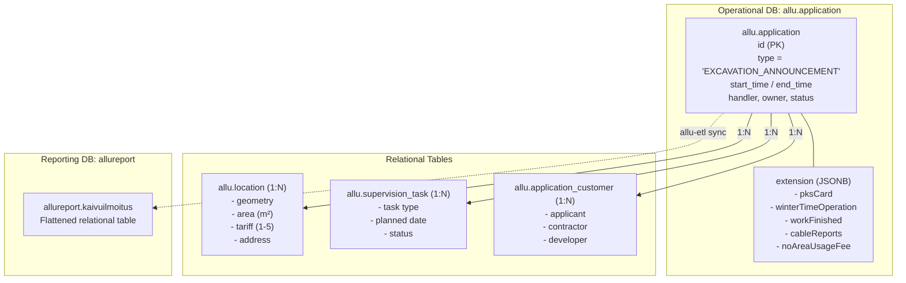
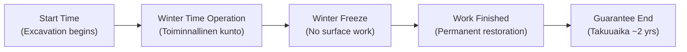
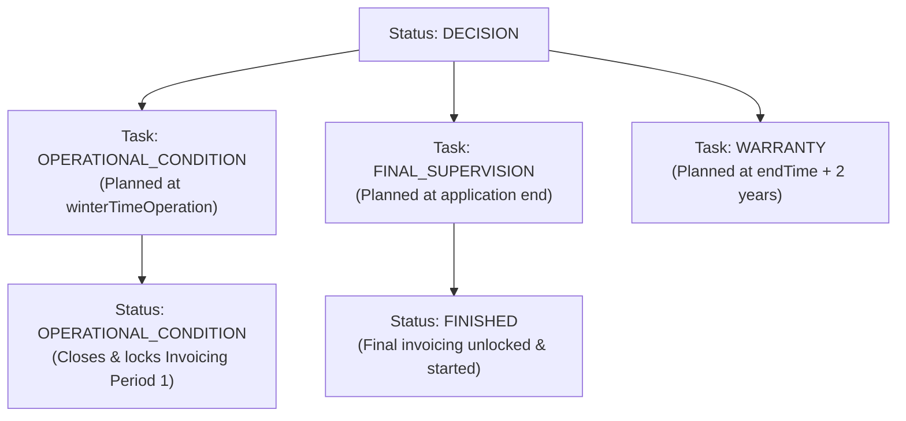

# Kaivuilmoitus (Excavation Announcement) Data Model

This document explains the data model and domain architecture of **Kaivuilmoitus** (Excavation Announcement) in the Allu system.

---

## 1. Domain Overview

In the City of Helsinki, any excavation or construction work conducted in public areas (streets, sidewalks, bike paths, public parks, market squares) requires notification, review, supervisory oversight, and payment of area usage and handling fees.

Within Allu:

- **Domain name (Finnish):** `Kaivuilmoitus`
- **Application type enum:** `ApplicationType.EXCAVATION_ANNOUNCEMENT`
- **Code identifier prefix:** Typically `KP` (Kaivuilmoitus Päätös / Kaivulupa), e.g. `KP2400123`

---

## 2. Persistence & Multi-Tier Architecture

Allu uses a polymorphic application model where generic application state is stored relationally, while type-specific data is stored in a structured JSON extension.

### 2.1 Operational Database (`allu.application`)

- **Single-Table Inheritance:** All applications share the `allu.application` table.
- **`extension` column (JSONB):** Type-specific fields for `EXCAVATION_ANNOUNCEMENT` are serialized into/out of this column. In Java, Jackson deserializes this into `fi.hel.allu.model.domain.ExcavationAnnouncement`.

### 2.2 Reporting Database (`allureport.kaivuilmoitus`)

- **ETL Transformation:** The `allu-etl` service executes SQL routines (`application.sql`) that parse the `extension` JSONB from `allu.application` and insert rows into the dedicated relational table `allureport.kaivuilmoitus`.

### 2.3 Layer Representations

| Layer | Class / Interface | Path |
| --- | --- | --- |
| **Backend Domain** | `ExcavationAnnouncement` | `backend/model-domain/src/main/java/fi/hel/allu/model/domain/ExcavationAnnouncement.java` |
| **Backend DTO (UI)** | `ExcavationAnnouncementJson` | `backend/service-core-domain/.../domain/ExcavationAnnouncementJson.java` |
| **External API In** | `ExcavationAnnouncementExt` | `backend/external-domain/.../domain/ExcavationAnnouncementExt.java` |
| **External API Out** | `ExcavationAnnouncementOutExt` | `backend/external-domain/.../domain/ExcavationAnnouncementOutExt.java` |
| **Frontend Model** | `ExcavationAnnouncement` | `frontend/src/app/model/application/excavation-announcement/excavation-announcement.ts` |
| **Frontend Form** | `ExcavationAnnouncementForm` | `frontend/src/app/feature/application/info/excavation-announcement/excavation-announcement.form.ts` |

---

## 3. Detailed Data Model

A complete Kaivuilmoitus instance comprises the core **Application** fields, the **ExcavationAnnouncement** extension, and related relational child entities.

### 3.1 The Extension Fields (`ExcavationAnnouncement`)

#### A. Work Classification (Työn luonne)

Boolean flags describing the purpose and authorization of the excavation:

- **`constructionWork`** (`Boolean`): New infrastructure construction (*Rakentaminen*).
- **`maintenanceWork`** (`Boolean`): Repair or maintenance of existing infrastructure (*Kunnossapito*).
- **`emergencyWork`** (`Boolean`): Emergency excavation done immediately to prevent imminent danger or damage before an official permit (*Hätätyö*).
- **`propertyConnectivity`** (`Boolean`): Connecting a private plot/property to city municipal networks (*Kiinteistöliitos / Tonttiliitos*).
- **`pksCard`** (`Boolean`): True if the contractor holds the Helsinki Metropolitan Area street work qualification card (*PKS-kortti*).
- **`selfSupervision`** (`Boolean`): True if the contractor is certified for municipal self-supervision (*Omavalvonta*). When enabled, handling fees are charged at a lower rate (`HANDLING_FEE_SELF_SUPERVISION`).

#### B. Two-Phase Time Tracking & Work Stages

Excavations often span winter freezes when asphalt plants close. Work proceeds in two distinct stages:

1. **Operational Condition (*Toiminnallinen kunto / Talvityön toiminnallinen kunto*)**:
   - `winterTimeOperation` (`ZonedDateTime`): Date when the excavation pit is backfilled and given temporary asphalt/surfacing so that traffic and pedestrians can safely pass over winter.
   - `customerWinterTimeOperation` (`ZonedDateTime`): Date requested/reported by the customer.
   - `operationalConditionReported` (`ZonedDateTime`): System timestamp when the customer reported operational readiness.
2. **Work Finished (*Työ valmis*)**:
   - `workFinished` (`ZonedDateTime`): Final completion date when permanent paving, curbing, and vegetation are restored.
   - `customerWorkFinished` (`ZonedDateTime`): Completion date reported by the customer.
   - `workFinishedReported` (`ZonedDateTime`): System timestamp when final completion was reported.
3. **Guarantee Period (*Takuuaika*)**:
   - `guaranteeEndTime` (`ZonedDateTime`): End date for contractor liability (usually 2 years from work completion) to repair any ground settlement or surface cracks.
4. **Unauthorized Work (*Luvaton kaivutyö*)**:
   - `unauthorizedWorkStartTime` (`ZonedDateTime`): Start time if excavation started without an approved permit.
   - `unauthorizedWorkEndTime` (`ZonedDateTime`): End time of unauthorized period.

#### C. Work Purpose & Progress Journal Convention (`workPurpose`)

- **`workPurpose`** (`String` / *Työn tarkoitus*): Baseline description of the excavation work (e.g. *"Puiston rakentaminen"* or *"Tiedonsiirtotyö"*).
- **Progress Journal Convention:** In live production projects, handlers use this field as a running, append-only project changelog using the `LISÄYS <DD.MM.YYYY>:` and `MUUTOS <DD.MM.YYYY>:` convention (see [Excavation Revisions](excavation-revisions.md) for details).
- **`additionalInfo`** (`String` / *Lisätiedot*): Optional additional freeform notes.

#### D. Traffic Arrangements (Liikennejärjestelyt)

- **`trafficArrangements`** (`String`): Freeform textual explanation or standard text detailing traffic detours, lane closures, and pedestrian pathways.
- **`trafficArrangementImpedimentType`** (`Enum`):
  - `NO_IMPEDIMENT` (*Ei haittaa*)
  - `INSIGNIFICANT_IMPEDIMENT` (*Vähäinen haitta*)
  - `IMPEDIMENT_FOR_HEAVY_TRAFFIC` (*Haittaa raskasta liikennettä*)
  - `SIGNIFICANT_IMPEDIMENT` (*Merkittävä haitta*)

#### E. Prerequisites & Related Applications

Excavations cannot occur safely without prior underground utility checks:

- **`cableReports`** (`List<String>`): Application IDs of prerequisite **Johtoselvitys** (Cable Clearance Reports).
- **`placementContracts`** (`List<String>`): Application IDs of related **Sijoitussopimus** (Placement Contracts for permanent utility placement in municipal land).
- **Replacement Lineage (`replacesApplicationId` / `replacedByApplicationId`):** When an excavation permit is amended (*korvaava päätös*), a new version is created (e.g. `KP2100964-112`) and linked to its predecessor (see [Excavation Revisions](excavation-revisions.md)).

#### F. Quality Assurance & Terms

- **`compactionAndBearingCapacityMeasurement`** (`Boolean`): Requires certified testing of soil compaction and load capacity (*Tiiveys- ja kantavuusmittaus*).
- **`qualityAssuranceTest`** (`Boolean`): Requires laboratory/field testing of asphalt or surface quality (*Päällysteen laadunvarmistuskoe*).
- **`terms`** (`String`): Official conditions and clauses imposed by the city inspector on the decision.

#### G. Fee Exemptions (ALLU-217)

- **`noAreaUsageFee`** (`Boolean`): Flag indicating that the daily area usage fee (*alueenkäyttömaksu*) should not be billed (e.g. for city-internal projects).
- **`noAreaUsageFeeReason`** (`String`): Mandatory justification required if `noAreaUsageFee` is true.

---

### 3.2 Stakeholders and Customer Roles (`CustomerWithContacts`)

Excavation applications link customers through `allu.application_customer` with explicit roles (`CustomerRoleType`):

| Role | Finnish Name | Requirement for Kaivuilmoitus |
| --- | --- | --- |
| **`APPLICANT`** | Hakija | Mandatory (initiator of the permit) |
| **`CONTRACTOR`** | Työn suorittaja | **Mandatory** (the entity physically digging) |
| **`PROPERTY_DEVELOPER`** | Rakennuttaja | Optional (the project client or property owner) |
| **`REPRESENTATIVE`** | Asiamies | Optional (consultant or agency submitting on behalf of applicant) |
| **`invoiceRecipientId`** | Laskutusasiakas | Reference to the customer receiving invoices (can be applicant, developer, contractor, or a separate billing address) |

---

### 3.3 Spatial Location & Geometry (`Location`)

Linked via `allu.location`:

- **`geometry`**: PostGIS geometry (polygon, linestring, point) in EPSG:3879 (ETRS-GK25FIN, Helsinki local coordinate system).
- **`area` / `areaOverride`**: Surface area of the excavation in square meters ($m^2$).
- **`paymentTariff` / `paymentTariffOverride`**: Payment class tariff (1 to 5) determined by street hierarchy:
  - `1`: Central commercial / high-traffic pedestrian street (highest daily fee)
  - `2`: Arterial / distributor road
  - `3`: Collector street
  - `4`: Local access / residential street
  - `5`: Park / unpaved area (lowest daily fee)
- **`underpass` (`Boolean`)**: Altakuljettava — true if scaffolding or bridges allow traffic/pedestrians to pass under the site without diversion.
- **`postalAddress` & `cityDistrictId`**: Street address and municipal district ID.

---

### 3.4 Classification: Kinds & Specifiers

Excavations must specify at least one `ApplicationKind` and optional `ApplicationSpecifier`s:

| ApplicationKind | Specifiers (`ApplicationSpecifier`) |
| --- | --- |
| **`STREET_AND_GREEN`** (*Katu- ja vihertyöt*) | `ASPHALT`, `INDUCTION_LOOP`, `COVER_STRUCTURE`, `STREET_OR_PARK`, `PAVEMENT`, `TRAFFIC_LIGHT`, `COMMERCIAL_DEVICE`, `TRAFFIC_STOP`, `BRIDGE`, `OUTDOOR_LIGHTING` |
| **`WATER_AND_SEWAGE`** (*Vesi / viemäri*) | `STORM_DRAIN`, `WELL`, `UNDERGROUND_DRAIN`, `WATER_PIPE`, `DRAIN` |
| **`ELECTRICITY`** (*Sähkö*) | `DISTRIBUTION_CABINET`, `ELECTRICITY_CABLE`, `ELECTRICITY_WELL` |
| **`DATA_TRANSFER`** (*Tiedonsiirto*) | `DISTRIBUTION_CABINET_OR_PILAR`, `DATA_CABLE`, `DATA_WELL` |
| **`HEATING_COOLING`** (*Lämmitys/viilennys*) | `STREET_HEATING`, `DISTRICT_HEATING`, `GEO_HEATING`, `DISTRICT_COOLING` |
| **`CONSTRUCTION`** (*Rakennus*) | `GROUND_ROCK_ANCHOR`, `UNDERGROUND_STRUCTURE`, `UNDERGROUND_SPACE`, `BASE_STRUCTURES`, `DRILL_PILE`, `CONSTRUCTION_EQUIPMENT`, `CONSTRUCTION_PART`, `GROUND_FROST_INSULATION`, `SMOKE_HATCH_OR_PIPE`, `STOP_OR_TRANSITION_SLAB`, `SUPPORTING_WALL_OR_PILE` |
| **`YARD`** (*Piha*) | `FENCE_OR_WALL`, `DRIVEWAY`, `STAIRS_RAMP`, `SUPPORTING_WALL_OR_BANK` |
| **`GEOLOGICAL_SURVEY`** (*Pohjatutkimus*) | `DRILLING`, `TEST_HOLE`, `GROUND_WATER_PIPE` |
| **`OTHER`** (*Muu*) | `ABSORBING_SEWAGE_SYSTEM`, `GAS_PIPE`, `OTHER` |

---

## 4. Lifecycle & Supervision Tasks (`SupervisionTask`)

Supervision tasks are automated via `ExcavationAnnouncementStatusChangeHandler`:

1. **On Decision Approved (`handleDecisionStatus`)**:
   - If `winterTimeOperation != null`: Creates an `OPERATIONAL_CONDITION` task scheduled for that date.
   - If `endTime != null`: Creates a `FINAL_SUPERVISION` task and a `WARRANTY` task scheduled 2 years out.
2. **On Operational Condition (`handleOperationalConditionStatus`)**:
   - Closes the active invoicing period for the excavation stage before winter.
   - Locks charge basis entries and flags the period as invoicable.
   - Removes the open operational condition supervision task.
3. **On Work Finished (`handleFinishedStatus`)**:
   - Triggers adjustments to area fees if the work completed before the winter period boundary.
   - Sets the remaining work period invoicable.
   - Transitions application state to `FINISHED`.

---

## 5. Pricing and Invoicing Structure (`ExcavationPricing`)

Excavation pricing (`ExcavationPricing.java`) consists of two primary fee components:

### 5.1 Handling & Supervision Fee (*Käsittely- ja työn valvontamaksu*)

- Charged as a single fixed fee (`ChargeBasisUnit.PIECE`).
- **Self-Supervision discount:** If `selfSupervision == true`, fee is charged via `HANDLING_FEE_SELF_SUPERVISION` (e.g. 60.00 €).
- **Duration brackets (from 1.3.2026):**
  - `< 6 months`: `HANDLING_FEE_LT_6_MONTHS` (e.g. 240.00 €)
  - `≥ 6 months`: `HANDLING_FEE_GE_6_MONTHS` (e.g. 400.00 €)
  - Before 1.3.2026: flat `HANDLING_FEE` (e.g. 240.00 €)

### 5.2 Daily Area Usage Fee (*Alueenkäyttömaksu*)

- Charged per square meter per day (`ChargeBasisUnit.DAY`).
- **Area brackets (post-2025):**
  - `< 60 m²`
  - `60 – 120 m²`
  - `121 – 250 m²`
  - `251 – 500 m²`
  - `501 – 1000 m²`
  - `> 1000 m²`
- Multiplied by the daily rate corresponding to the location's **payment class (1–5)**.
- **Winter freeze rules:** In Helsinki, during winter (managed by `WinterTimeService`), daily fees are not charged for the freeze period if the work has reached operational condition. The pricing splits the duration into pre-winter and post-winter priced periods.
- **Exemption:** If `noAreaUsageFee == true`, this component is excluded from charge basis entries.

---

## 6. Key Code References

| Subsystem | File Path |
| --- | --- |
| Domain Model | `backend/model-domain/src/main/java/fi/hel/allu/model/domain/ExcavationAnnouncement.java` |
| Pricing Calculator | `backend/model-service/src/main/java/fi/hel/allu/model/pricing/ExcavationPricing.java` |
| Status Transition Handler | `backend/model-service/src/main/java/fi/hel/allu/model/service/event/handler/ExcavationAnnouncementStatusChangeHandler.java` |
| Invoicing Periods | `backend/model-service/src/main/java/fi/hel/allu/model/service/InvoicingPeriodService.java` |
| Winter Freeze Logic | `backend/model-service/src/main/java/fi/hel/allu/model/service/WinterTimeService.java` |
| ETL Transformation | `backend/allu-etl/src/main/resources/db/etl/application.sql` |
| ETL Reporting Schema | `backend/allu-etl/src/main/resources/db/migration/V5__add_application_types.sql` |
| Frontend Model | `frontend/src/app/model/application/excavation-announcement/excavation-announcement.ts` |
| Frontend Component Template | `frontend/src/app/feature/application/info/excavation-announcement/excavation-announcement.component.html` |
| Frontend Form Mapper | `frontend/src/app/feature/application/info/excavation-announcement/excavation-announcement.form.ts` |
| External REST Input DTO | `backend/external-domain/src/main/java/fi/hel/allu/external/domain/ExcavationAnnouncementExt.java` |
| External REST Output DTO | `backend/external-domain/src/main/java/fi/hel/allu/external/domain/ExcavationAnnouncementOutExt.java` |
