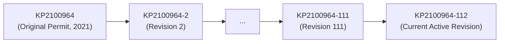
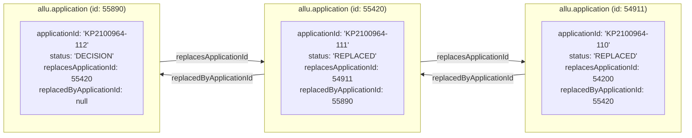
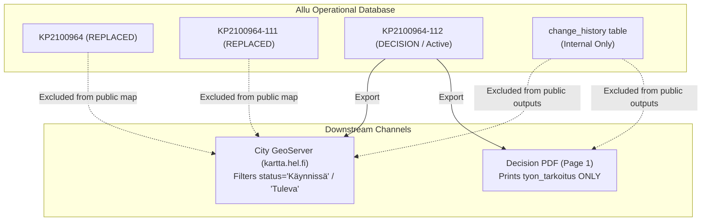

# Excavation History, Revision Chains & Field Changelogs

Canonical home for two facts that several other documents refer to: how
replacement chains (*korvaava päätös*) work, and the `tyon_tarkoitus`
progress-journal convention. Link here rather than restating them.

This document details how Allu manages **historical excavation data**, **multi-revision amendment chains** (*korvaava päätös*), and the operational convention where city handlers use the **`tyon_tarkoitus`** (*work purpose*) field as a cumulative progress journal.

---

## 1. Revision Chains & Replacement Applications (*Korvaava päätös*)

Major urban construction projects in Helsinki (such as tramline extensions, bridge renewals, and district-wide utility overhauls) span years and encounter frequent changes in phasing, traffic arrangements, and work areas.

Rather than mutating an existing legally approved permit, Allu executes an **amendment decision** (*korvaava päätös*) via `ApplicationReplacementService.java`.

### 1.1 Identifier Versioning (`ApplicationIdUtil.java`)

Application identifiers track their revision count using a hyphenated suffix:



- **Base permit:** `KP2100964` (`ApplicationIdUtil.getBaseApplicationId()`)
- **Successive versions:** `KP2100964-2`, `KP2100964-3`, ..., `KP2100964-112`
- Each version represents an officially approved municipal decision with its own timestamp, legal terms, and signing official.

### 1.2 Linked-List Pointer Architecture in PostgreSQL

Every revision is stored as an independent row in `allu.application`. They form a bidirectional linked list:



### 1.3 Lifecycle of a Replacement

When `replaceApplication(applicationId, userId)` is invoked:

1. **Cloning:** Core entities (geometries, customer roles, approved supervision tasks, attachments, manual fee items) are duplicated onto a new record.
2. **Status update:**
   - Previous application status becomes **`StatusType.REPLACED`** (*Korvattu*).
   - New replacing application status starts at **`StatusType.HANDLING`** (*Käsittelyssä*) until finalized into **`StatusType.DECISION`**.
3. **Invoicing periods:** Invoicing periods are updated to maintain billing continuity across periods.
4. **Target state preservation:** Approved supervision tasks (like preliminary or operational inspections) are carried forward.

---

## 2. The `tyon_tarkoitus` Progress Journal Convention

In the Allu data schema, `tyon_tarkoitus` (`workPurpose`) was designed as a brief, one-sentence description of the excavation (e.g. *"Vesijohtoliitos"* or *"Puiston rakentaminen"*).

In practice, for multi-year infrastructure works, city handlers and contractors have adopted an operational convention of using this text field as a **cumulative, append-only progress log**.

### 2.1 Scale in Live Production Data

A scan of the production dataset (`avoindata:Kaivuilmoitus_alue`) reveals the extreme scale of this pattern:

| Permit Identifier | Location & Project | Character Count | Line Count | Revision Count |
| --- | --- | --- | --- | --- |
| **`KP2100964-112`** | Hakaniemi, Merihaka, Siltasaarenkatu (Kruunusillat) | **14,142** | **124** | **112** revisions |
| **`KP2200616-65`** | Koirasaarentie (Laajasalo tramline) | **4,691** | **67** | **65** revisions |
| **`KP2200667-46`** | Koirasaarentie välillä Laajasalontie – Reiherintie | **3,367** | **47** | **46** revisions |
| **`KP2101001-36`** | Hakaniemen silta / Pohjoisranta | **2,651** | **37** | **36** revisions |
| **`KP2402616-20`** | Jätkäsaarenlaituri 1 (Quay walls & bridges) | **1,566** | **21** | **20** revisions |

### 2.2 Syntax & Formatting Pattern

Each entry begins with the baseline project scope, followed by chronological newline-delimited entries:

```text
<Initial baseline project scope>

LISÄYS <DD.MM.YYYY>: <Description of phase release, new plan, or extension>
MUUTOS <DD.MM.YYYY>: <Description of parameter change or contact update>
```

### 2.3 What Gets Logged in the Field?

- **Traffic Arrangement (TLJ) Plans:** Phased pedestrian/vehicle detours (*"uusi liikennejärjestelysuunnitelma käyttöön 2.11.2022 alkaen"*).
- **Night Work Approvals:** Special working hours (*"hulevesilinjan rakennustyöt yötyönä 24.-28.10.2022 klo 20.00-06.00"*).
- **Schedule Extensions:** Changes to validity boundaries (*"päättymispäivä 30.11.2021 -> 31.12.2026"*).
- **Geographic Area Expansions:** Additional street sections (*"Kaivulupa-alueen laajennus Sörnäisten rantatiellä Pannukakunpuistikon kohdalla"*).
- **Contractor & Responsible Person Handovers:** Entity swaps (*"rakennuttaja ja työnsuorittaja YIT Housing Oy -> YIT Infra Oy, yhteyshenkilö muutettu"*).
- **Prerequisite Cable Clearances:** Survey references (*"uusi johtoselvitys JS2300568"*).
- **GDPR Redactions:** Scrubbing superseded personal phone numbers or names (*"Henkilötietoja poistettu"*).

### 2.4 Why Did Handlers Start Doing This? (Root Cause)



1. **Visibility on Decision PDFs:**
   In the XSL stylesheets (`EXCAVATION_ANNOUNCEMENT.xsl`), `tyon_tarkoitus` is printed prominently on page 1 under **"Työn kuvaus"** (Work Description). Internal audit logs and comments are not rendered on the legal permit.
2. **Public Map Visibility:**
   The public GIS layer (`avoindata:Kaivuilmoitus_alue`) filters out `REPLACED` applications so that the public map does not render 112 overlapping duplicate polygons for the same street. Because superseded revisions disappear from the map, handlers maintain the cumulative changelog inside `tyon_tarkoitus` so that police, emergency services, and transport operators (HSL) always see the full project history in map popups.

---

## 3. Querying History and Revisions

Query capabilities differ depending on whether you are querying the **City Open Data GIS Feed**, the **Internal UI REST API**, or the **External System API**.

### 3.1 City Open Data GIS (GeoServer WFS at `kartta.hel.fi`)

#### A. Querying the Active Permit and Its Embedded Journal

Only the latest active revision is published in `avoindata:Kaivuilmoitus_alue`:

```bash
curl -s "https://kartta.hel.fi/ws/geoserver/avoindata/wfs?SERVICE=WFS&VERSION=1.1.0&REQUEST=GetFeature&TYPENAME=avoindata:Kaivuilmoitus_alue&cql_filter=hakemustunnus='KP2100964-112'&outputFormat=application/json" | jq '.features[0].properties.tyon_tarkoitus'
```

#### B. Querying Historical Closed Permits (2010–Present)

Historical works that finished in earlier years are archived in `avoindata:Winkki_works`:

```bash
curl -s "https://kartta.hel.fi/ws/geoserver/avoindata/wfs?SERVICE=WFS&VERSION=1.1.0&REQUEST=GetFeature&TYPENAME=avoindata:Winkki_works&cql_filter=event_startdate%3C'2015-01-01'&MAXFEATURES=5&outputFormat=application/json" | jq '.features[] | {id: .properties.licence_identifier, desc: .properties.event_description, start: .properties.event_startdate}'
```

---

### 3.2 Internal UI REST API (`allu-ui-service`, Port 9000)

Authorized internal users and tools can inspect the entire underlying database graph:

#### A. Search Across All Revisions (Including `REPLACED`)

By default, Elasticsearch queries exclude replaced applications. Including `status.value: ["REPLACED"]` returns all historic revisions:

```bash
curl -s -X POST -H "Authorization: Bearer $TOKEN" -H "Content-Type: application/json" \
  -d '{
    "queryParameters": [
      { "fieldName": "applicationId", "fieldValue": "KP2100964*" },
      { "fieldName": "status.value", "fieldMultiValue": ["REPLACED", "DECISION", "FINISHED"] }
    ]
  }' \
  "https://allu.kaupunkiymparisto.fi/api/applications/search"
```

#### B. Traversal of the Linked-List Chain

Given any revision ID, fetch the full application payload:

```bash
curl -s -X GET -H "Authorization: Bearer $TOKEN" \
  "https://allu.kaupunkiymparisto.fi/api/applications/55890" | jq '{id: .id, applicationId: .applicationId, replacesApplicationId: .replacesApplicationId, replacedByApplicationId: .replacedByApplicationId}'
```

- Following `replacesApplicationId` walks backwards through previous revisions.
- Following `replacedByApplicationId` walks forwards toward the latest active revision.

#### C. Field-Level User Audit Trail

Every micro-edit is logged in `allu.change_history` with XPath-style field diffs:

```bash
curl -s -X GET -H "Authorization: Bearer $TOKEN" \
  "https://allu.kaupunkiymparisto.fi/api/applications/55890/history"
```

**Response Format (`ChangeHistoryItemJson`):**

```json
[
  {
    "changeType": "CONTENTS_CHANGED",
    "changeTime": "2026-09-08T09:57:24Z",
    "user": { "userName": "handler1", "realName": "City Official" },
    "fieldChanges": [
      {
        "fieldName": "/extension/winterTimeOperation",
        "oldValue": "2026-11-15T00:00:00Z",
        "newValue": "2026-12-31T00:00:00Z"
      }
    ]
  }
]
```

---

### 3.3 External System API (`external-service`, Port 9040)

External contractors and utility companies can query the event history of their owned applications:

```bash
curl -s -X POST -H "Authorization: Bearer $EXT_TOKEN" -H "Content-Type: application/json" \
  -d '{"applicationIds": [10041], "eventsAfter": "2020-01-01T00:00:00Z"}' \
  https://allu.kaupunkiymparisto.fi/external/v1/applicationhistory
```

**Response Format (`ApplicationHistoryExt`):**

```json
[
  {
    "applicationId": 10041,
    "events": [
      {
        "eventTime": "2026-09-08T09:57:24Z",
        "newStatus": "HANDLING",
        "applicationIdentifier": "KP2600006"
      }
    ],
    "supervisionEvents": []
  }
]
```

---

## 4. Synthetic Test Data vs. Live Production Data

| Dimension | Test Environment (`testi.allu.kaupunkiymparisto.fi`) | Production Environment (`allu.kaupunkiymparisto.fi`) |
| --- | --- | --- |
| **Data Nature** | 100% Synthetic / Mock / Automated Test Data | Official Municipal Legal Registry |
| **Application Naming** | Test automation suffixes: `TA-...-Quebec`, `TA-...-Tango` | Real projects: *"Kruunusillat"*, *"Hyväntoivonpuisto"* |
| **Customer Entities** | Fictional companies: *"Penan putki ja puhallus"*, *"Maken kaivu"* | Real utilities & builders: *YIT Infra Oy*, *NCC*, *Helen*, *Elisa*, *HSY* |
| **User Accounts** | Mock user `ALLUTE` (Title: *"Kaikkivaltias"* / Almighty) | Real municipal engineers and authorized city inspectors |
| **Authentication Enforcement** | Permissive test login (`/api/auth/login`) enabled | Enforces Microsoft Azure AD / ADFS OAuth2 single sign-on (`403 Login forbidden` for dummy endpoint) |
| **Volume** | ~6 excavation announcements | Over 100,000+ active and historical permits dating to 2010 |
