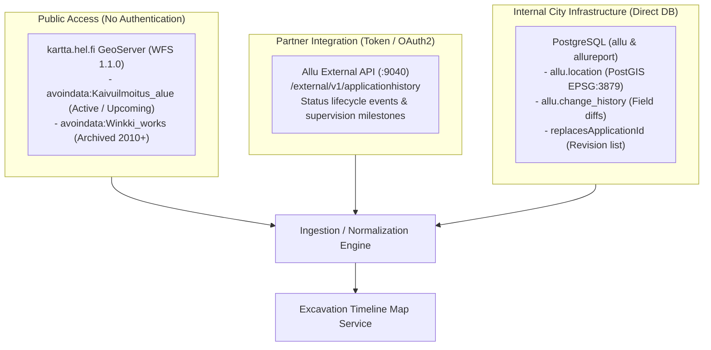
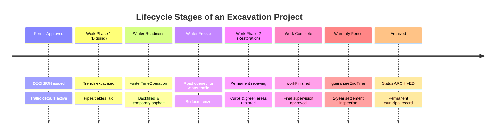
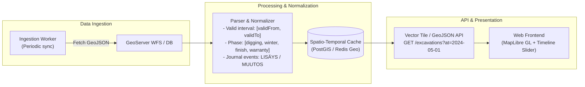

# Excavation Map & Timeline Service: Architecture & Integration Guide

> **Forum Virium Helsinki design document.** It describes a service that does
> not exist yet, not a part of Allu. Background on the platform it reads from:
> [excavation announcements](../domain/excavation-announcement.md),
> [excavation revisions](../domain/excavation-revisions.md),
> [API gateways](../architecture/api-gateways.md).

This guide provides technical specifications, integration recipes, and architectural recommendations for building a web service that displays City of Helsinki excavation information on an interactive map with a timeline control for viewing past, present, and scheduled events.

---

## 1. Domain & Data Availability Overview

* **Domain Entity:** `Kaivuilmoitus` (Excavation Announcement, enum: `ApplicationType.EXCAVATION_ANNOUNCEMENT`, identifier prefix: `KP`).
* **Permanent Data Retention:** Excavations represent official municipal legal decisions. In Allu, **excavations are never pruned or hard-deleted**. Complete records dating back to **2010+** (over 100,000 active and historical permits) are preserved.
* **Excluded from Automated GDPR Scrubbing:** The nightly GDPR anonymization job (`anonymizeApplications` at 03:00 AM) applies exclusively to cable reports (`CABLE_REPORT`). Excavation geometries, technical specifiers, customer links, and descriptions are retained indefinitely.
* **Multi-Revision Amendment History:** Complex urban works (e.g. tramlines, bridge overhauls) span years and produce up to 100+ revision versions (*korvaava päätös*) tracking changing boundaries, phasing, and traffic arrangements.

---

## 2. Ingestion Sources & Integration Options

Depending on access level, infrastructure, and authentication capabilities, three integration paths exist:



### Option A: Public City Open Data (GeoServer WFS at `kartta.hel.fi`)

Recommended for public-facing web applications. No authentication is required; returns standard GeoJSON with on-the-fly reprojection.

#### 1. Active & Upcoming Excavations (`avoindata:Kaivuilmoitus_alue`)

Publishes current active permits (`Käynnissä`) and future scheduled permits (`Tuleva`).

```bash
curl -s "https://kartta.hel.fi/ws/geoserver/avoindata/wfs?\
SERVICE=WFS&\
VERSION=1.1.0&\
REQUEST=GetFeature&\
TYPENAME=avoindata:Kaivuilmoitus_alue&\
outputFormat=application/json&\
srsName=EPSG:4326&\
cql_filter=alkuhetki<='2025-06-01T00:00:00Z' AND loppuhetki>='2025-01-01T00:00:00Z'"
```

**Key GeoJSON Feature Properties:**

* `hakemustunnus`: Permit identifier (e.g. `KP2400123` or revision `KP2100964-112`).
* `alkuhetki` / `loppuhetki`: Work start and end timestamps.
* `tila`: Operational status (`Käynnissä` = in progress, `Tuleva` = upcoming).
* `tyon_tarkoitus`: Baseline description and cumulative changelog.
* `kadun_nimi` / `osoite`: Street name and address.
* `geometry`: Polygon or MultiPolygon.

#### 2. Historical Closed Excavations (`avoindata:Winkki_works`)

Contains historical works completed from 2010 onward.

```bash
curl -s "https://kartta.hel.fi/ws/geoserver/avoindata/wfs?\
SERVICE=WFS&\
VERSION=1.1.0&\
REQUEST=GetFeature&\
TYPENAME=avoindata:Winkki_works&\
outputFormat=application/json&\
srsName=EPSG:4326&\
cql_filter=event_startdate>='2020-01-01' AND event_enddate<='2020-12-31'&\
MAXFEATURES=1000"
```

---

### Option B: Allu External System API (`external-service`, Port 9040)

Recommended when integrating with an authorized partner token or city e-service.

* **Documentation / Swagger:** `https://allu.kaupunkiymparisto.fi/external/swagger-ui.html`
* **OpenAPI Spec:** `https://allu.kaupunkiymparisto.fi/external/v3/api-docs`
* **Lifecycle & Event History Endpoint:** `POST /external/v1/applicationhistory`

```bash
curl -s -X POST -H "Authorization: Bearer $EXT_TOKEN" \
  -H "Content-Type: application/json" \
  -d '{"applicationIds": [10041], "eventsAfter": "2020-01-01T00:00:00Z"}' \
  "https://allu.kaupunkiymparisto.fi/external/v1/applicationhistory"
```

The `ApplicationHistoryExt` response shape is documented in
[excavation revisions §3.3](../domain/excavation-revisions.md#33-external-system-api-external-service-port-9040).

**Limitation for this service:** the endpoint returns events for the queried
application only. Querying revision 112 of a chain yields that revision's events,
not the eleven years before it, unless the client discovers and queries all 112
internal IDs itself. Closing this gap is
[upstream proposal 1](upstream-proposals.md#2-proposal-1-recursive-revision-traversal-in-applicationhistoryservice).

---

### Option C: Direct Reporting Warehouse (`allureport` PostgreSQL)

Recommended for city-internal microservices deployed inside the city network.

* **Database / Port:** PostgreSQL on port `5433` (database: `allureport`).
* **Flattened Tables:**
  * `allureport.kaivuilmoitus`: Flattens the `extension` JSONB columns into relational fields (`talvityon_toiminnallinen_kunto`, `tyo_valmis`, `takuu_paattyy`).
  * `allureport.sijainti` & `allureport.sijainti_geometria`: Spatial geometries in native EPSG:3879.
  * `allureport.valvontatehtava`: Inspection task schedules and outcomes.
  * `allu.change_history` & `allu.field_change` (in operative DB): Field-by-field micro audit trail.

---

## 3. Data Model & Temporal Timeline Modeling

To accurately drive a timeline slider, the service must model the multi-stage lifecycle of an excavation.



### 3.1 Critical Date Fields

| Field Name | Type | Description / Role in Timeline |
| --- | --- | --- |
| **`startTime`** | `ZonedDateTime` | Official start of permit validity and work commencement. |
| **`endTime`** | `ZonedDateTime` | Official permit end date. |
| **`winterTimeOperation`** | `ZonedDateTime` | *Toiminnallinen kunto*: backfilling and temporary resurfacing completed for safe winter traffic. |
| **`workFinished`** | `ZonedDateTime` | *Työ valmis*: permanent final paving and restoration completed. |
| **`guaranteeEndTime`** | `ZonedDateTime` | *Takuuaika*: contractor warranty period (usually 2 years post-completion). |
| **`unauthorizedWorkStartTime` / `EndTime`** | `ZonedDateTime` | Recorded if digging commenced before permit approval. |

### 3.2 Status Progression

$$\text{PRE\_RESERVED} \longrightarrow \text{HANDLING} \longrightarrow \text{DECISION} \longrightarrow \text{OPERATIONAL\_CONDITION} \longrightarrow \text{FINISHED} \longrightarrow \text{ARCHIVED}$$

*(Terminated or canceled projects end in `TERMINATED` or `CANCELLED`.)*

### 3.3 Revisions & Replacement Chains (*Korvaava päätös*)

Amendment decisions create linked revision chains — mechanics, identifier
versioning, and the `replacesApplicationId` / `replacedByApplicationId` pointers
are documented in
[excavation revisions](../domain/excavation-revisions.md#1-revision-chains--replacement-applications-korvaava-päätös).

What matters for a timeline specifically: **each revision can add or remove
street polygons, alter tariff classes, or shift traffic detour zones.** The
geometry is not stable across a chain, so a revision's shape is only valid for
the interval during which that revision was the active one — see §4.3.

---

## 4. Key Gotchas & Implementation Traps

### 4.1 The `tyon_tarkoitus` Progress Journal Pattern

City handlers use the `tyon_tarkoitus` (*work purpose*) field as a cumulative,
date-stamped progress log — why they do this, what gets logged, and the scale it
reaches in production are documented in
[excavation revisions §2](../domain/excavation-revisions.md#2-the-tyon_tarkoitus-progress-journal-convention).

The consequence for this service is that the field must be **parsed, not
displayed**: it is the only place where mid-project events (traffic-arrangement
changes, area expansions, contractor handovers) are recorded in a
publicly-reachable feed, and it arrives as one unstructured string.

* **Timeline Extraction Recipe:**
  Extract dated progress markers from the text using a regular expression:

  ```typescript
  interface JournalEntry {
    type: 'LISÄYS' | 'MUUTOS';
    date: Date; // parsed from DD.MM.YYYY
    description: string;
  }

  function parseWorkJournal(text: string): JournalEntry[] {
    const regex = /(LISÄYS|MUUTOS)\s+(\d{1,2}\.\d{1,2}\.\d{4}):\s*([^\n\r]+)/g;
    const entries: JournalEntry[] = [];
    let match: RegExpExecArray | null;

    while ((match = regex.exec(text)) !== null) {
      const [_, type, dateStr, description] = match;
      const [day, month, year] = dateStr.split('.').map(Number);
      entries.push({
        type: type as 'LISÄYS' | 'MUUTOS',
        date: new Date(Date.UTC(year, month - 1, day)),
        description: description.trim()
      });
    }
    return entries;
  }
  ```

### 4.2 Spatial Projections

* **Native Storage:** Coordinates are stored in **EPSG:3879** (ETRS89 / GK25FIN, meter coordinates).
* **Web Mapping:** Web mapping clients (MapLibre GL, Leaflet, OpenLayers) expect **EPSG:4326** (WGS84) or **EPSG:3857** (Web Mercator).
* When querying GeoServer WFS, always supply `&srsName=EPSG:4326` to delegate reprojection to GeoServer.

### 4.3 Avoiding Overlapping Polygons on the Timeline

* If querying the raw database or revision chains:
  * For any point in time $T$, only one revision in a replacement chain was legally active.
  * **Temporal Rule:** Display revision $R$ if and only if:
    $$\text{decisionDate}(R) \le T < \text{decisionDate}(\text{nextRevision}(R))$$
  * Failing to filter by decision timestamp will render 20–100 stacked polygons over the same street.

---

## 5. Recommended Architecture for the Service



### 5.1 Temporal Feature Schema

Store normalized spatial features with discrete temporal validity intervals:

```json
{
  "type": "Feature",
  "id": "KP2100964-112",
  "geometry": {
    "type": "Polygon",
    "coordinates": [[[24.95, 60.17], "..."]]
  },
  "properties": {
    "identifier": "KP2100964",
    "revision": 112,
    "validFrom": "2021-04-01T00:00:00Z",
    "validTo": "2026-12-31T23:59:59Z",
    "stages": {
      "operationalCondition": "2022-11-15T00:00:00Z",
      "workFinished": "2026-10-31T00:00:00Z",
      "guaranteeEnd": "2028-10-31T00:00:00Z"
    },
    "timelineEvents": [
      {
        "timestamp": "2022-11-02T00:00:00Z",
        "category": "TRAFFIC_ARRANGEMENT",
        "title": "Phase 2 traffic detours active"
      },
      {
        "timestamp": "2023-04-12T00:00:00Z",
        "category": "WORK_AREA_EXTENSION",
        "title": "Work area expanded to Sörnäisten rantatie"
      }
    ]
  }
}
```

### 5.2 Timeline Slider Visualization Logic

When the user moves the timeline slider to timestamp $T$:

1. **Polygon Visibility Filter:**

   ```typescript
   function isFeatureVisibleAt(feature: ExcavationFeature, T: Date): boolean {
     return new Date(feature.properties.validFrom) <= T &&
            T <= new Date(feature.properties.validTo);
   }
   ```

2. **Phase-Based Color Coding:**

   | Phase Condition | Map Polygon Style | UI State Badge |
   | --- | --- | --- |
   | $T < \text{startTime}$ | Dashed grey border, semi-transparent | Scheduled / Upcoming (*Tuleva*) |
   | $\text{startTime} \le T < \text{winterTimeOperation}$ | High-visibility orange / red fill | Active Excavation (*Käynnissä*) |
   | $\text{winterTimeOperation} \le T < \text{workFinished}$ | Yellow fill / hatched pattern | Winter Operation (*Toiminnallinen kunto*) |
   | $\text{workFinished} \le T < \text{guaranteeEndTime}$ | Light blue fill | Permanent Restoration (*Valmis / Takuuaika*) |
   | $T \ge \text{guaranteeEndTime}$ | Faded blue / muted outline | Archived (*Arkistoitu*) |

3. **Event Scrub Markers:**
   Render small milestone beads along the timeline scrubber bar corresponding to `timelineEvents` (status changes, supervision approvals, journal notes). Clicking a marker snaps the timeline to that date and pans the map to the excavation site.
