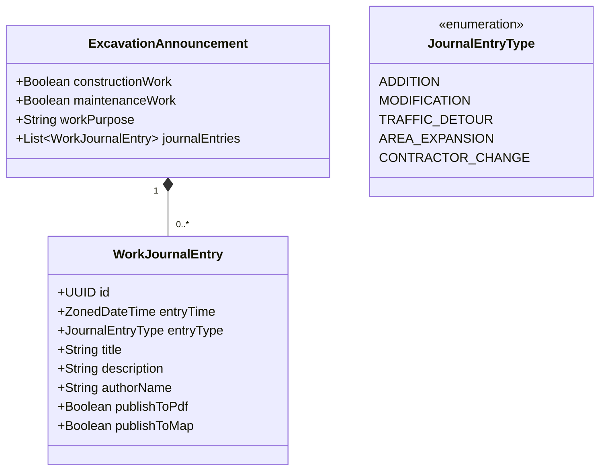

# Upstream Contribution Proposals: Excavation Timeline & Map Services

> **Status: working draft, nothing submitted.** None of this has been raised
> with the upstream maintainers ([City-of-Helsinki/allu](https://github.com/City-of-Helsinki/allu),
> developed by Gofore). This file is where the proposals are drafted, not where
> they belong permanently — see §6 for what raising them would actually involve.
> Background on the mechanisms being changed:
> [excavation revisions](../domain/excavation-revisions.md) and
> [API gateways](../architecture/api-gateways.md).

This document details proposed upstream improvements to the Allu platform. These proposals arise from requirements identified when designing a spatio-temporal map service with a timeline control for excavation announcements (*Kaivuilmoitus* / `EXCAVATION_ANNOUNCEMENT`), but they also deliver immediate benefits to city handlers, field inspectors, transit operators (HSL), and emergency services.

---

## 1. Executive Summary & Impact Matrix

Four distinct initiatives, ranging from a low-effort API enhancement to a
foundational data model change. Effort and blast radius below describe the
*size and risk of each change*; they are not a schedule, and §6 explains why
this document gives none.

| Proposal | Primary Module | Effort | Blast Radius | Key Beneficiaries |
| :--- | :--- | :--- | :--- | :--- |
| **1. Revision Traversal in History** | `service-core`, `external-service` | Low | Minimal (backward-compatible) | External B2B integrators, contractors, e-services |
| **2. Spatio-Temporal Search API** | `external-service`, `search-service` | Medium | Low (new endpoint) | Mobile field apps, external web portals, dashboards |
| **3. Temporal Validity View (WMS-T)** | `allu-etl`, `allureport` | Low | Zero (additive reporting view) | City GeoServer, HSL, police, rescue services, open data |
| **4. Structured Work Journal** | `model-domain`, `allu-ui-service`, UI | High | Medium (model extension + XSLT) | City handlers, decision makers, public transparency |

---

## 2. Proposal 1: Recursive Revision Traversal in `ApplicationHistoryService`

### 2.1 Problem Statement

When an excavation permit is modified (*korvaava päätös*), a new revision is created (e.g. `KP2100964-112`). In PostgreSQL, revisions form a linked list via `replacesApplicationId`.

Currently, `POST /external/v1/applicationhistory` only returns events belonging directly to the queried `applicationId`. If a client queries revision 112, it receives only the events that occurred under revision 112; the entire multi-year history of revisions 1 through 111 is omitted unless the client independently discovers and queries all 112 distinct internal database IDs.

### 2.2 Proposed Solution

Extend `ApplicationHistoryService.java` to recursively traverse the revision chain and consolidate history events into a single chronological stream.

#### Backend Changes

1. **Request DTO (`ApplicationHistorySearchExt.java`):**
   Add an optional boolean flag:

   ```java
   @Schema(description = "If true, traverses replacesApplicationId chains to include events from previous permit revisions. Default: false.")
   private Boolean includeRevisionLineage = false;
   ```

2. **Service Implementation (`ApplicationHistoryService.java`):**

   ```java
   public List<ApplicationHistoryExt> findApplicationHistories(ApplicationHistorySearchExt search) {
       List<Integer> targetIds = new ArrayList<>(search.getApplicationIds());

       if (Boolean.TRUE.equals(search.getIncludeRevisionLineage())) {
           List<Integer> allLineageIds = new ArrayList<>();
           for (Integer id : targetIds) {
               allLineageIds.addAll(resolveCompleteRevisionChain(id));
           }
           // Fetch history items for all revisions and group/merge by base permit identifier
           return mergeLineageHistories(allLineageIds);
       }
       // Existing single-revision logic...
   }
   ```

3. **Response DTO (`ApplicationHistoryExt.java`):**
   Add revision identification metadata so clients know which revision triggered each event:

   ```java
   public class ApplicationStatusEventExt {
       private Integer revisionNumber;
       private String applicationIdentifier; // e.g. "KP2100964-110"
       // existing: status, eventTime
   }
   ```

### 2.3 Rationale for Maintainers

* **Backward Compatible:** Defaults to `false`, leaving existing API consumers unaffected.
* **Solves a Known Limitation:** Directly addresses the fragmentation of history in long-running construction projects.

---

## 3. Proposal 2: Spatio-Temporal Excavation Query Endpoint in `external-service`

### 3.1 Problem Statement

External clients cannot currently query Allu by geographic bounding box (`bbox`) and temporal intersection. The external API requires prior knowledge of application IDs or customer relationships. Third parties wishing to render an excavation map must either ingest the entire open dataset from GeoServer or poll the internal UI API.

### 3.2 Proposed Solution

Add a specialized spatio-temporal endpoint to `external-service`:

```http
POST /external/v2/excavations/search
Content-Type: application/json
```

#### Request Payload (`ExcavationSpatialSearchExt`)

```json
{
  "boundingBox": {
    "minX": 24.90,
    "minY": 60.15,
    "maxX": 24.98,
    "maxY": 60.20
  },
  "coordinateSystem": "EPSG:4326",
  "temporalFilter": {
    "effectiveAt": "2024-06-15T00:00:00Z",
    "statusFilter": ["DECISION", "OPERATIONAL_CONDITION", "FINISHED"]
  },
  "includeGeometry": true
}
```

#### Response Payload

Standard GeoJSON `FeatureCollection` where each feature includes:

* Geometry in requested SRS (`EPSG:4326` or `EPSG:3879`).
* Lifecycle milestones: `startTime`, `endTime`, `winterTimeOperation`, `workFinished`, `guaranteeEndTime`.
* Traffic impact: `trafficArrangementImpedimentType`, `trafficArrangements`.
* Contractor and responsible organizer names.

### 3.3 Rationale for Maintainers

* Positions Allu as a modern API-first municipal platform.
* Enables external mobility applications (e.g. navigation apps, micromobility operators, logistics dispatchers) to retrieve active city disruptions on demand.

---

## 4. Proposal 3: Temporal Revision Validity View in `allu-etl` for GeoServer (WMS-T)

### 4.1 Problem Statement

The open data GIS feed (`avoindata:Kaivuilmoitus_alue`) filters out `status = 'REPLACED'` to prevent dozens of overlapping polygons from rendering simultaneously over the same street. While necessary for static maps, this completely hides the geographic evolution of street works from historical queries.

### 4.2 Proposed Solution

Create an additive materialized view or table in the reporting database (`allureport`) that explicitly calculates the legal validity period of every revision.

#### ETL SQL Migration (`backend/allu-etl/src/main/resources/db/migration/`)

```sql
CREATE TABLE allureport.kaivuilmoitus_aikajana AS
SELECT
    h.id AS hakemus_id,
    h.hakemuksen_tunnus,
    k.hakemus_id AS kaivuilmoitus_id,
    h.tila,
    h.alkuaika,
    h.loppuaika,
    k.toiminnallinen_kunto,
    k.tyo_valmis,
    k.takuu_paattyy,
    k.tyon_tarkoitus,
    -- Effective validity start: decision time or creation time
    COALESCE(h.paatosaika, h.luontiaika) AS voimassa_alku,
    -- Effective validity end: replaced date of successor revision, or work end date
    COALESCE(
        (SELECT MIN(succ.paatosaika)
         FROM allureport.hakemus succ
         WHERE succ.korvaava_hakemus_id = h.id),
        h.loppuaika
    ) AS voimassa_loppu,
    sg.geometria
FROM allureport.hakemus h
JOIN allureport.kaivuilmoitus k ON k.hakemus_id = h.id
LEFT JOIN allureport.sijainti s ON s.hakemus_id = h.id
LEFT JOIN allureport.sijainti_geometria sg ON sg.sijainti_id = s.id
WHERE h.tila NOT IN ('CANCELLED');

CREATE INDEX idx_kaivuilmoitus_aikajana_aika
ON allureport.kaivuilmoitus_aikajana (voimassa_alku, voimassa_loppu);

CREATE INDEX idx_kaivuilmoitus_aikajana_geom
ON allureport.kaivuilmoitus_aikajana USING GIST (geometria);
```

#### GeoServer WMS-T Configuration

With `voimassa_alku` and `voimassa_loppu` explicitly materialized, the City GIS team can register this view in GeoServer with **WMS Time Dimension** enabled:

```http
GET https://kartta.hel.fi/ws/geoserver/avoindata/wms?
  SERVICE=WMS&VERSION=1.3.0&REQUEST=GetMap&
  LAYERS=avoindata:Kaivuilmoitus_aikajana&
  TIME=2023-05-15T12:00:00Z&
  CRS=EPSG:3879&BBOX=...&FORMAT=image/png
```

### 4.3 Rationale for Maintainers

* **Zero Core Impact:** Changes live entirely within `allu-etl` and `allureport`; the core operational database (`allu`) is untouched.
* **Standard OGC Compliant:** Allows GIS analysts, city planners, and external developers to query historical city conditions using standard GIS tools (QGIS, ArcGIS) without custom code.

---

## 5. Proposal 4: Structured Work Journal (`WorkJournalEntry`)

### 5.1 Problem Statement

City handlers currently maintain a running progress log inside the `tyon_tarkoitus` (*work purpose*) text field, using conventions like `LISÄYS 12.04.2023: ...` and `MUUTOS 05.09.2023: ...`. In large projects, this string grows to **14,000+ characters**.

Handlers do this because:

1. It is the only field printed prominently on page 1 of the official permit PDF.
2. It is the only narrative field published in the public GeoServer map popup.
3. Allu lacks a dedicated "Public Journal / Work Diary" entity.

This practice is error-prone for handlers and forces downstream systems to rely on brittle regular expressions to extract dates and milestones.

### 5.2 Proposed Solution

Replace the unstructured text pattern with a first-class `WorkJournalEntry` domain model.



#### 1. Backend Model (`backend/model-domain`)

Add `journalEntries` to `ExcavationAnnouncement.java`:

```java
public class WorkJournalEntry {
    private UUID id = UUID.randomUUID();
    private ZonedDateTime entryTime;
    private JournalEntryType entryType;
    private String title;
    private String description;
    private String authorName;
    private boolean publishToPdf = true;
    private boolean publishToMap = true;
}
```

#### 2. Frontend UI (`frontend/src/app/feature/application/info/`)

Replace the freeform textarea with a structured table and entry dialog:

* **Date picker:** Defaults to current date/time.
* **Entry type dropdown:** *Lisäys*, *Muutos*, *Liikennejärjestely*, *Aluelaajennus*.
* **Title & Description:** Clean separate inputs.
* **Audit trail:** Read-only timestamps showing when each note was added.

#### 3. Decision PDF Generation (`pdf-service` & XSLT)

Update `EXCAVATION_ANNOUNCEMENT.xsl` to render `journalEntries` in a formatted, chronological table under the legal permit conditions:

```xml
<xsl:if test="count(journalEntries/entry) &gt; 0">
  <div class="section-title">Työn vaiheet ja lisäykset (Työpäiväkirja)</div>
  <table class="journal-table">
    <thead>
      <tr><th>Päivämäärä</th><th>Tyyppi</th><th>Kuvaus</th></tr>
    </thead>
    <xsl:for-each select="journalEntries/entry">
      <tr>
        <td><xsl:value-of select="entryTimeFormatted"/></td>
        <td><xsl:value-of select="entryTypeDescription"/></td>
        <td><xsl:value-of select="description"/></td>
      </tr>
    </xsl:for-each>
  </table>
</xsl:if>
```

#### 4. Backward Compatibility & Data Migration

* Write a one-time database migration script that uses the existing regex pattern to parse legacy `tyon_tarkoitus` strings and populate the new `journalEntries` array for historical records.
* Maintain `workPurpose` as a clean, single-sentence summary of the original project scope (e.g. *"Kruunusiltojen raitiotien rakennustyöt"*).

### 5.3 Rationale for Maintainers

* **Immediate Handler UX Improvement:** Handlers no longer risk accidental deletions or cursor errors in 10,000-character textareas.
* **Cleaner Decision Documents:** Decision PDFs gain professional, tabular formatting for project amendments.
* **Clean Data API:** External apps receive typed, structured milestone events natively.

---

## 6. Contribution sequencing

**No dates, deliberately.** None of this has been agreed with the upstream
maintainers, so whether any of it is taken up — and when — is their decision,
not something this document can schedule.

What can be said is the order in which the proposals make sense, which follows
from how much agreement each needs before code is worth writing:

1. **Proposal 1 (revision traversal)** is the smallest and most self-contained:
   one service class and its DTOs, gated behind a flag defaulting to `false`,
   so existing consumers are unaffected.
2. **Proposal 3 (temporal validity view)** is confined to `allu-etl` SQL and the
   `allureport` schema, and can be exercised in reporting or staging without
   touching the operational database.
3. **Proposals 2 and 4 (spatio-temporal API, structured work journal)** need
   design agreement first. Proposal 4 in particular changes the domain model,
   the UI, and the decision PDF at once, and its entry categories should be
   confirmed with the handlers who maintain the field today.

### What raising these would actually involve

Checked against the upstream repository on 2026-09-11, because it bears on how a
proposal should be introduced:

- All 145 pull requests in the repository's history were opened from a branch
  **inside** the repository, by consultants with write access. No fork-based
  pull request has ever been submitted.
- No issue has ever been filed, and GitHub Discussions are disabled.
- There is no `CONTRIBUTING.md`, issue template, or pull request template.

There is no established route for an outside contribution, and no evidence of
how one would be received in either direction. An unannounced pull request would
be the first the maintainers have handled. Establishing contact through the
channels the city and Forum Virium already share is likely to get further than
the repository's own tooling, which nobody outside the development team has
used.
